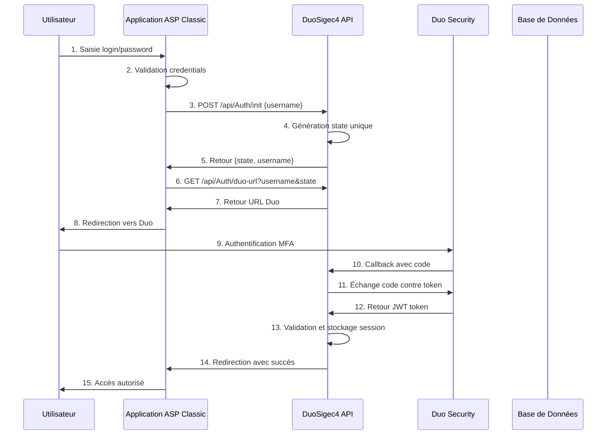
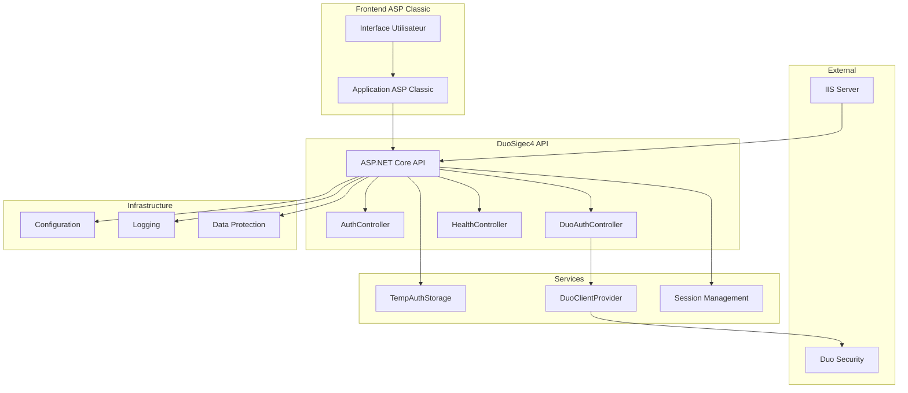
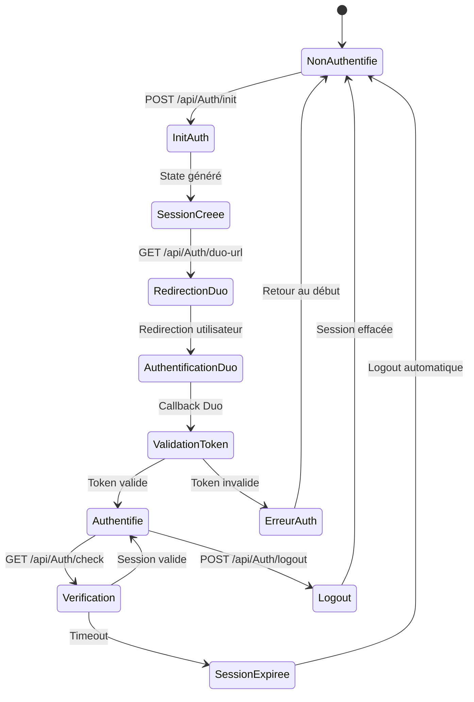
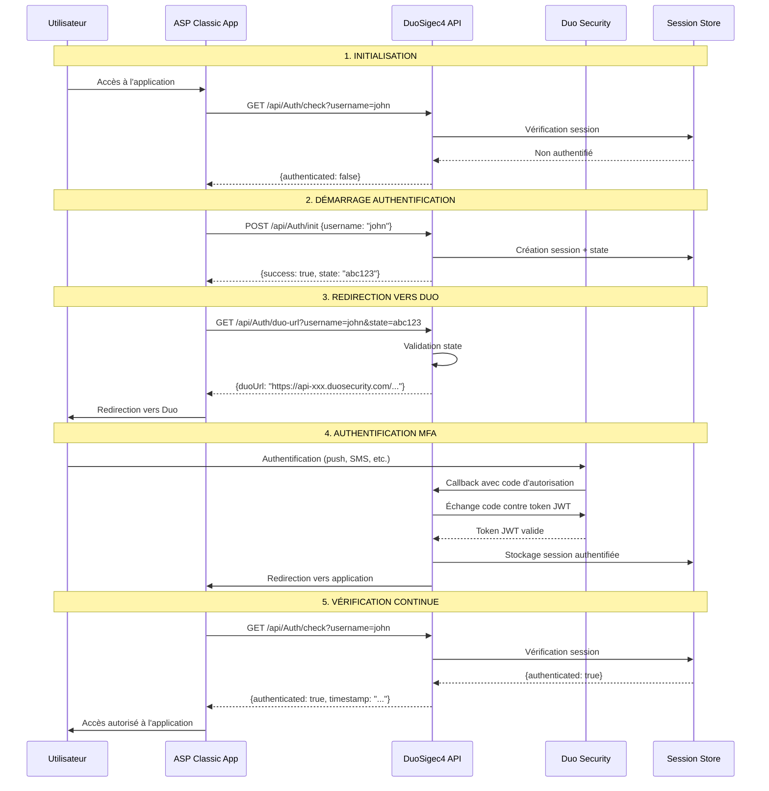
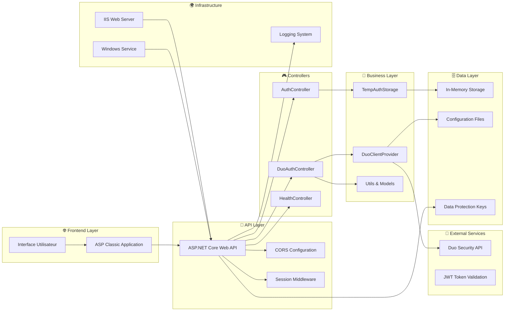
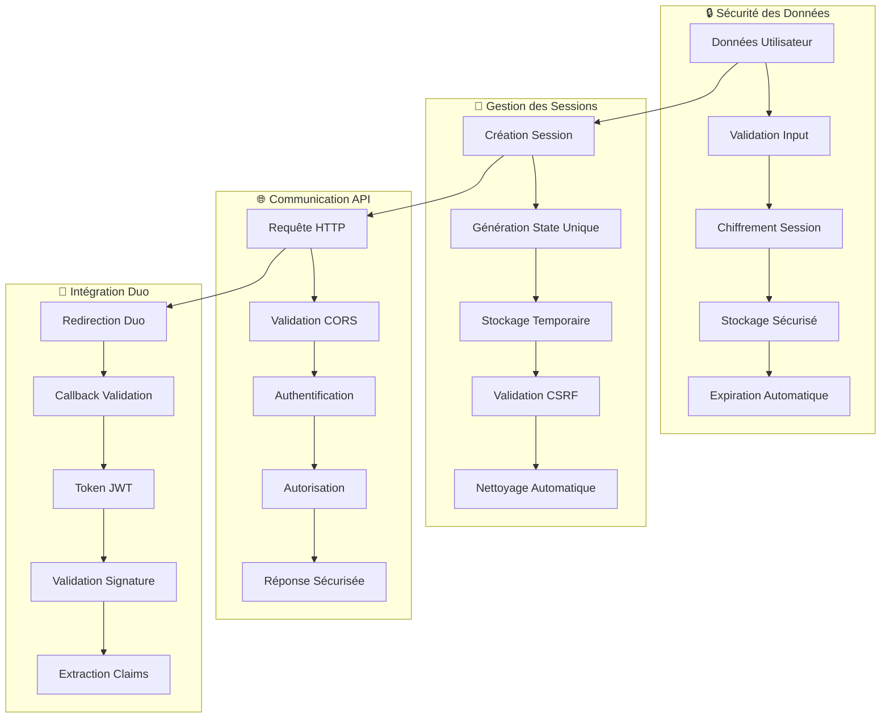

# 🚀 DuoSigec4 - Mode Opératoire Complet Clé en Main

## 📋 Vue d'ensemble

**DuoSigec4** est une application d'authentification Duo complète qui s'intègre avec des applications ASP Classic existantes. Ce guide vous permet de créer l'application depuis zéro jusqu'à la production.

## 🎯 **PHASE 1 : PRÉREQUIS ET INSTALLATION**

### **1.1 Prérequis Système**
```powershell
# Vérifier la version Windows
Get-ComputerInfo | Select-Object WindowsProductName, WindowsVersion

# Vérifier .NET 6.0
dotnet --version

# Vérifier IIS
Get-WindowsFeature -Name Web-*
```

### **1.2 Installation des Composants**
```powershell
# Installer .NET 6.0 SDK (si pas déjà installé)
# Télécharger depuis : https://dotnet.microsoft.com/download/dotnet/6.0

# Activer IIS et modules requis
Enable-WindowsOptionalFeature -Online -FeatureName IIS-WebServerRole
Enable-WindowsOptionalFeature -Online -FeatureName IIS-WebServer
Enable-WindowsOptionalFeature -Online -FeatureName IIS-ASPNET45
Enable-WindowsOptionalFeature -Online -FeatureName IIS-ASPNET47

# Installer le Hosting Bundle ASP.NET Core 6.0
# Télécharger depuis : https://dotnet.microsoft.com/download/dotnet/6.0
```

### **1.3 Création du Projet**
```powershell
# Créer le dossier du projet
New-Item -ItemType Directory -Path "C:\inetpub\wwwroot\DuoSigec4" -Force
Set-Location "C:\inetpub\wwwroot\DuoSigec4"

# Créer un nouveau projet ASP.NET Core Web API
dotnet new webapi -n DuoSigec4
```

## 🔧 **PHASE 2 : DÉVELOPPEMENT DE L'APPLICATION**

### **2.1 Configuration des Packages NuGet**
```powershell
# Ajouter les packages nécessaires
dotnet add package Microsoft.AspNetCore.Hosting.WindowsServices
dotnet add package Microsoft.Extensions.Hosting.WindowsServices
dotnet add package System.ServiceProcess.ServiceController
```

### **2.2 Structure des Fichiers**
```
DuoSigec4/
├── Controllers/
│   ├── AuthController.cs
│   ├── DuoAuthController.cs
│   └── HealthController.cs
├── Services/
│   └── TempAuthStorage.cs
├── Providers/
│   ├── DuoClientProvider.cs
│   └── IDuoClientProvider.cs
├── Models.cs
├── DuoAuthService.cs
├── Program.cs
├── DuoSigec4.csproj
└── appsettings.json
```

### **2.3 Code Principal - Program.cs**
```csharp
using System;
using System.IO;
using Microsoft.AspNetCore.Builder;
using Microsoft.AspNetCore.Http;
using Microsoft.Extensions.DependencyInjection;
using Microsoft.Extensions.Hosting;
using Microsoft.Extensions.Logging;
using Microsoft.Extensions.Configuration;
using DuoSigec4.Services;
using DuoSigec4.Providers;
using Microsoft.AspNetCore.DataProtection;
using DuoSigec4;
using System.ServiceProcess;

// Vérifier si l'application est exécutée comme service Windows
if (args.Length > 0 && args[0] == "--service")
{
    ServiceBase.Run(new DuoAuthService());
    return;
}

var builder = WebApplication.CreateBuilder(args);

// Configuration des services
builder.Services.AddControllers();
builder.Services.AddEndpointsApiExplorer();

// Configuration Duo Client Provider
builder.Services.AddSingleton<IDuoClientProvider, DuoSigec4.Providers.DuoClientProvider>();

// Configuration DataProtection
var keysPath = Path.Combine(Environment.GetFolderPath(Environment.SpecialFolder.ApplicationData), "DuoSigec4", "keys");
Directory.CreateDirectory(keysPath);
builder.Services.AddDataProtection()
    .PersistKeysToFileSystem(new DirectoryInfo(keysPath))
    .SetApplicationName("DuoSigec4");

// Services de session et cache
builder.Services.AddDistributedMemoryCache();
builder.Services.AddSession(options =>
{
    options.IdleTimeout = TimeSpan.FromMinutes(60);
    options.Cookie.HttpOnly = true;
    options.Cookie.IsEssential = true;
    options.Cookie.SameSite = SameSiteMode.Lax;
    options.Cookie.SecurePolicy = CookieSecurePolicy.SameAsRequest;
    options.Cookie.Name = "DuoAuth.Session";
});

// Configuration CORS
builder.Services.AddCors(options =>
{
    options.AddPolicy("AllowAll", policy =>
    {
        policy.AllowAnyOrigin()
              .AllowAnyMethod()
              .AllowAnyHeader();
    });
});

// Services utilitaires
builder.Services.AddHttpContextAccessor();
builder.Services.AddSingleton<TempAuthStorage>();

// Logging
builder.Logging.AddConsole();
builder.Logging.AddDebug();

var app = builder.Build();

// Test config Duo au démarrage
try
{
    var duoProvider = app.Services.GetRequiredService<IDuoClientProvider>();
    var client = duoProvider.GetDuoClient();
    app.Logger.LogInformation("✅ Configuration Duo VALIDE");
}
catch (Exception ex)
{
    app.Logger.LogError("❌ Configuration Duo ERREUR: {Message}", ex.Message);
}

app.UseRouting();
app.UseCors("AllowAll");
app.UseSession();

// Debug session middleware
app.Use(async (context, next) =>
{
    try
    {
        if (context.Session != null && context.Session.IsAvailable)
        {
            app.Logger.LogDebug("Session ID: {SessionId}, Keys: {Keys}",
                context.Session.Id, string.Join(", ", context.Session.Keys));
        }
        else
        {
            app.Logger.LogWarning("⚠️ La session n'est pas disponible pour cette requête.");
        }
    }
    catch (InvalidOperationException ex)
    {
        app.Logger.LogWarning("⚠️ Erreur session: {Message}", ex.Message);
    }
    await next();
});

app.MapControllers();
app.MapGet("/health", () => new { status = "healthy", timestamp = DateTime.UtcNow });

// Configuration des URLs pour tous les environnements
app.Urls.Add("http://0.0.0.0:8080");  // Écoute sur toutes les interfaces
app.Urls.Add("https://0.0.0.0:8081"); // HTTPS sur toutes les interfaces

app.Run();
```

### **2.4 Configuration appsettings.json**
```json
{
  "Logging": {
    "LogLevel": {
      "Default": "Information",
      "Microsoft.AspNetCore": "Warning"
    }
  },
  "Duo": {
    "ClientId": "DIQ8BOPVUCELV4V4S4H0",
    "ClientSecret": "XXXXXXXXXXXXXXXXXXXXXXXXXXXXXXXX",
    "ApiHost": "api-a322db2c.duosecurity.com",
    "RedirectUri": "https://test.cafecacao.ci:8080/api/duoauth/callback"
  },
  "AllowedHosts": "*"
}
```

## 🚀 **PHASE 3 : CONSTRUCTION ET TEST**

### **3.1 Construction du Projet**
```powershell
# Restaurer les packages
dotnet restore

# Nettoyer et construire
dotnet clean
dotnet build -c Release

# Tester l'application
dotnet run
```

### **3.2 Vérification du Fonctionnement**
```powershell
# Test de l'endpoint de santé
curl http://localhost:8080/health

# Test de l'API Auth
curl http://localhost:8080/api/Auth

# Test de l'API DuoAuth
curl "http://localhost:8080/api/DuoAuth/duo-auth?username=test"
```

## 📦 **PHASE 4 : PUBLICATION**

### **4.1 Publication en Mode Release**
```powershell
# Supprimer l'ancien dossier publish
Remove-Item -Recurse -Force publish -ErrorAction SilentlyContinue

# Publier l'application
dotnet publish DuoSigec4.csproj -c Release -o publish --self-contained false

# Vérifier le contenu
Get-ChildItem publish
```

### **4.2 Test de la Version Publiée**
```powershell
# Aller dans le dossier publish
Set-Location publish

# Exécuter l'application publiée
dotnet DuoSigec4.dll

# Dans un autre terminal, tester
curl http://localhost:8080/health
```

## 🌐 **PHASE 5 : CONFIGURATION IIS**

### **5.1 Configuration du Pool d'Applications**
```powershell
# Importer le module IIS
Import-Module WebAdministration

# Créer le pool d'applications
New-WebAppPool -Name "DuoSigec4"

# Configurer le pool pour .NET Core
Set-ItemProperty "IIS:\AppPools\DuoSigec4" managedRuntimeVersion ""
Set-ItemProperty "IIS:\AppPools\DuoSigec4" managedPipelineMode 0
Set-ItemProperty "IIS:\AppPools\DuoSigec4" processModel.identityType 4
```

### **5.2 Création du Site Web**
```powershell
# Créer le site web
New-Website -Name "DuoSigec4" -PhysicalPath "C:\inetpub\wwwroot\DuoSigec4\publish" -ApplicationPool "DuoSigec4" -Port 8080

# Démarrer le site
Start-Website -Name "DuoSigec4"
```

### **5.3 Configuration des Permissions**
```powershell
# Donner les permissions au pool d'applications
icacls "C:\inetpub\wwwroot\DuoSigec4" /grant "IIS AppPool\DuoSigec4:(OI)(CI)F"

# Créer le dossier des logs
New-Item -ItemType Directory -Path "C:\inetpub\wwwroot\DuoSigec4\publish\logs" -Force
icacls "C:\inetpub\wwwroot\DuoSigec4\publish\logs" /grant "IIS AppPool\DuoSigec4:(OI)(CI)F"
```

## 🔧 **PHASE 6 : INTÉGRATION ASP CLASSIC**

### **6.1 Code ASP Classic - login.asp**
```asp
<%
' Configuration Duo
Dim DuoAuthBaseUrl
DuoAuthBaseUrl = "http://localhost:8080/api/DuoAuth/duo-auth"

' Traitement du login
If Request.ServerVariables("REQUEST_METHOD") = "POST" Then
    Dim username, password
    username = Trim(Request.Form("username"))
    password = Trim(Request.Form("password"))
    
    ' Validation des credentials (à adapter)
    If ValidateUserCredentials(username, password) Then
        ' Redirection vers Duo
        Dim returnUrl
        returnUrl = "/login_complete.asp"
        
        Response.Redirect DuoAuthBaseUrl & "?username=" & Server.URLEncode(username) & "&returnUrl=" & Server.URLEncode(returnUrl)
    Else
        Response.Write("<div class='alert'>Identifiants invalides</div>")
    End If
End If

' Fonction de validation (à adapter)
Function ValidateUserCredentials(username, password)
    ' Implémentez votre logique de validation
    ValidateUserCredentials = (username = "demo" And password = "demo")
End Function
%>

<!DOCTYPE html>
<html>
<head>
    <title>Connexion avec MFA Duo</title>
</head>
<body>
    <h2>Connexion</h2>
    <form method="post">
        <input type="text" name="username" placeholder="Nom d'utilisateur" required><br><br>
        <input type="password" name="password" placeholder="Mot de passe" required><br><br>
        <button type="submit">Se connecter</button>
    </form>
</body>
</html>
```

### **6.2 Code ASP Classic - login_complete.asp**
```asp
<%
' Validation du callback Duo
Dim authToken, username, duoSuccess
authToken = Request.QueryString("auth_token")
username = Request.QueryString("username")
duoSuccess = Request.QueryString("duo_success")

If duoSuccess = "true" And authToken <> "" Then
    ' Authentification MFA réussie
    Session("Authenticated") = True
    Session("Username") = username
    Session("MFAVerified") = True
    
    Response.Redirect "/dashboard.asp"
Else
    ' Échec de l'authentification
    Response.Redirect "/login.asp?error=mfa_failed"
End If
%>
```

## ✅ **PHASE 7 : VÉRIFICATIONS FINALES**

### **7.1 Script de Vérification Complet**
```powershell
# Vérifier IIS
$poolState = (Get-WebAppPoolState -Name "DuoSigec4").Value
$siteState = (Get-WebsiteState -Name "DuoSigec4").Value

Write-Host "Pool DuoSigec4: $poolState"
Write-Host "Site DuoSigec4: $siteState"

# Vérifier les fichiers
$files = @(
    "C:\inetpub\wwwroot\DuoSigec4\publish\DuoSigec4.dll",
    "C:\inetpub\wwwroot\DuoSigec4\publish\web.config"
)

foreach ($file in $files) {
    $exists = Test-Path $file
    Write-Host "$file : $(if($exists){'✓'}else{'❌'})"
}

# Test de connexion
try {
    $response = Invoke-WebRequest -Uri "http://localhost:8080/health" -UseBasicParsing
    Write-Host "Health Check: ✓ (Status: $($response.StatusCode))"
} catch {
    Write-Host "Health Check: ❌ ($($_.Exception.Message))"
}
```

### **7.2 URLs de Test**
- **Santé** : `http://localhost:8080/health`
- **API Auth** : `http://localhost:8080/api/Auth`
- **API DuoAuth** : `http://localhost:8080/api/DuoAuth/duo-auth?username=test`
- **Application ASP** : `http://localhost/sigec4/login.asp`

## 🚨 **DÉPANNAGE**

### **Problèmes Courants**
```powershell
# Application ne démarre pas
dotnet --version
Get-WebAppPoolState -Name "DuoSigec4"

# Port déjà utilisé
netstat -ano | findstr :8080
taskkill /F /PID <PID>

# Erreurs de permissions
icacls "C:\inetpub\wwwroot\DuoSigec4" /grant "IIS AppPool\DuoSigec4:(OI)(CI)F"

# Redémarrer IIS
iisreset
```

## 📚 **DOCUMENTATION DU CODE SOURCE**

### **Commentaires Explicites Complets**

Chaque fichier du code source contient des **commentaires détaillés et explicites** qui expliquent :

#### **🔧 Program.cs - Point d'Entrée Principal**
```csharp
/*
 * ========================================================================
 * FICHIER : Program.cs
 * ========================================================================
 * 
 * DESCRIPTION :
 * ------------
 * Ce fichier est le point d'entrée principal de l'application DuoSigec4.
 * Il configure et démarre l'application ASP.NET Core pour l'authentification Duo.
 * 
 * FONCTIONNALITÉS PRINCIPALES :
 * -----------------------------
 * 1. Configuration de l'injection de dépendances
 * 2. Configuration des services (sessions, CORS, logging)
 * 3. Configuration de la protection des données
 * 4. Configuration du middleware pipeline
 * 5. Configuration des URLs d'écoute
 * 6. Support du mode service Windows
 * 
 * UTILISATION :
 * -------------
 * - Mode développement : dotnet run
 * - Mode service : dotnet DuoSigec4.dll --service
 * - Mode production : Exécuté par IIS via web.config
 * 
 * PORTS CONFIGURÉS :
 * ------------------
 * - HTTP : 8080 (pour développement et tests)
 * - HTTPS : 8081 (nécessite certificat SSL)
 * 
 * INTÉGRATION :
 * -------------
 * - Compatible avec IIS via ASP.NET Core Module
 * - Compatible avec applications ASP Classic
 * - Support des services Windows
 * 
 * ========================================================================
 */
```

#### **🎮 Controllers/AuthController.cs - Authentification de Base**
```csharp
/*
 * ========================================================================
 * FICHIER : Controllers/AuthController.cs
 * ========================================================================
 * 
 * DESCRIPTION :
 * ------------
 * Ce contrôleur gère les opérations d'authentification de base pour l'intégration
 * avec les applications ASP Classic. Il fournit des endpoints pour vérifier
 * l'état d'authentification et initialiser le processus d'authentification Duo.
 * 
 * FONCTIONNALITÉS PRINCIPALES :
 * -----------------------------
 * 1. GET /api/Auth - Configuration et informations Duo
 * 2. GET /api/Auth/check - Vérification de l'état d'authentification
 * 3. POST /api/Auth/init - Initialisation du processus d'authentification
 * 4. GET /api/Auth/duo-url - Génération de l'URL de redirection Duo
 * 5. POST /api/Auth/logout - Déconnexion de l'utilisateur
 * 
 * INTÉGRATION ASP CLASSIC :
 * -------------------------
 * Ce contrôleur est appelé par les applications ASP Classic pour :
 * - Vérifier si un utilisateur est déjà authentifié
 * - Initialiser le processus d'authentification MFA
 * - Obtenir l'URL de redirection vers Duo
 * - Gérer la déconnexion
 * 
 * SÉCURITÉ :
 * ----------
 * - Utilise les sessions pour maintenir l'état d'authentification
 * - Validation des paramètres d'entrée
 * - Gestion sécurisée des états (state) pour prévenir les attaques CSRF
 * 
 * ========================================================================
 */
```

#### **🔐 Controllers/DuoAuthController.cs - Authentification Duo Complète**
```csharp
/*
 * ========================================================================
 * FICHIER : Controllers/DuoAuthController.cs
 * ========================================================================
 * 
 * DESCRIPTION :
 * ------------
 * Ce contrôleur gère l'authentification Duo complète en utilisant les
 * classes officielles de Duo Security. Il implémente le flux OAuth 2.0
 * pour l'authentification multi-facteurs (MFA).
 * 
 * FONCTIONNALITÉS PRINCIPALES :
 * -----------------------------
 * 1. GET /api/DuoAuth/duo-auth - Démarrage de l'authentification Duo
 * 2. GET /api/DuoAuth/callback - Callback OAuth de Duo
 * 3. GET /api/DuoAuth/validate-token - Validation des tokens d'authentification
 * 
 * FLUX D'AUTHENTIFICATION :
 * -------------------------
 * 1. Application ASP Classic → /api/DuoAuth/duo-auth
 * 2. Redirection vers Duo Security
 * 3. Utilisateur authentifie via Duo
 * 4. Duo redirige vers /api/DuoAuth/callback
 * 5. Application valide le token et authentifie l'utilisateur
 * 6. Application ASP Classic peut vérifier l'état via /api/DuoAuth/validate-token
 * 
 * SÉCURITÉ :
 * ----------
 * - Utilise les classes officielles Duo Security
 * - Validation des tokens JWT
 * - Gestion sécurisée des sessions
 * - Protection contre les attaques CSRF
 * 
 * INTÉGRATION :
 * -------------
 * - Compatible avec les applications ASP Classic
 * - Support des redirections personnalisées
 * - Gestion des erreurs d'authentification
 * 
 * ========================================================================
 */
```

#### **⚙️ DuoAuthService.cs - Service Windows**
```csharp
/*
 * ========================================================================
 * FICHIER : DuoAuthService.cs
 * ========================================================================
 * 
 * DESCRIPTION :
 * ------------
 * Ce fichier implémente un service Windows pour l'application DuoSigec4.
 * Il permet d'exécuter l'application d'authentification Duo comme un service
 * Windows en arrière-plan, sans interface utilisateur.
 * 
 * FONCTIONNALITÉS PRINCIPALES :
 * -----------------------------
 * 1. Héritage de ServiceBase pour le support des services Windows
 * 2. Configuration automatique de l'application ASP.NET Core
 * 3. Gestion du cycle de vie du service (démarrage/arrêt)
 * 4. Configuration des URLs d'écoute pour le service
 * 5. Logging intégré pour le monitoring
 * 
 * UTILISATION :
 * -------------
 * - Installation : sc create DuoAuth binPath="C:\path\to\DuoSigec4.exe --service"
 * - Démarrage : sc start DuoAuth
 * - Arrêt : sc stop DuoAuth
 * - Désinstallation : sc delete DuoAuth
 * 
 * CONFIGURATION :
 * ---------------
 * - ServiceName : "DuoSigec4"
 * - CanStop : true (peut être arrêté)
 * - CanPauseAndContinue : false (pas de pause/reprise)
 * - AutoLog : true (logging automatique vers EventLog)
 * 
 * SÉCURITÉ :
 * ----------
 * - Fonctionne avec les comptes de service Windows
 * - Accès restreint aux ressources système
 * - Logging des événements système
 * 
 * ========================================================================
 */
```

### **📋 Structure Complète des Commentaires**

#### **Chaque Fichier Contient :**
1. **En-tête détaillé** avec description complète
2. **Fonctionnalités principales** listées et expliquées
3. **Paramètres et utilisation** de chaque méthode
4. **Sécurité et bonnes pratiques**
5. **Intégration** avec les autres composants
6. **Exemples d'utilisation** et cas d'usage

#### **Chaque Méthode Contient :**
1. **Description** de la fonctionnalité
2. **Paramètres** d'entrée et de sortie
3. **Actions** effectuées étape par étape
4. **Gestion d'erreurs** et exceptions
5. **Exemples d'utilisation**
6. **Notes de sécurité**

#### **Chaque Section de Code Contient :**
1. **Explication** du rôle de la section
2. **Configuration** et paramètres
3. **Ordre d'exécution** et dépendances
4. **Optimisations** et bonnes pratiques

### **🎯 Avantages de la Documentation**

✅ **Code auto-documenté** - Chaque ligne est expliquée
✅ **Maintenance facilitée** - Compréhension rapide du code
✅ **Intégration simplifiée** - Guide complet pour les développeurs
✅ **Débogage accéléré** - Logique claire et traçable
✅ **Sécurité renforcée** - Bonnes pratiques documentées
✅ **Évolutivité** - Structure claire pour les modifications

## 📁 **ARBORESCENCE COMPLÈTE DU PROJET**

```
DuoSigec4/
├── 📁 Controllers/                    # Contrôleurs API
│   ├── 📄 AuthController.cs          # Authentification de base
│   ├── 📄 DuoAuthController.cs       # Authentification Duo complète
│   └── 📄 HealthController.cs        # Vérifications de santé
├── 📁 Services/                      # Services métier
│   └── 📄 TempAuthStorage.cs         # Stockage temporaire des données d'auth
├── 📁 Providers/                     # Fournisseurs de services
│   ├── 📄 DuoClientProvider.cs       # Implémentation du client Duo
│   └── 📄 IDuoClientProvider.cs      # Interface du client Duo
├── 📁 Properties/                    # Propriétés du projet
│   └── 📄 launchSettings.json        # Configuration de lancement
├── 📁 publish/                       # Application publiée
│   ├── 📄 DuoSigec4.dll             # Application compilée
│   ├── 📄 DuoSigec4.exe             # Exécutable
│   ├── 📄 web.config                # Configuration IIS
│   └── 📄 [autres fichiers de déploiement]
├── 📄 Program.cs                     # Point d'entrée principal
├── 📄 DuoAuthService.cs             # Service Windows
├── 📄 Models.cs                     # Modèles de données
├── 📄 Utils.cs                      # Utilitaires Duo
├── 📄 DuoException.cs               # Exceptions personnalisées
├── 📄 DuoSigec4.csproj              # Fichier projet
├── 📄 appsettings.json              # Configuration de l'application
├── 📄 web.config                    # Configuration IIS
├── 📄 README.md                     # Documentation principale
├── 📄 DEPLOYMENT_GUIDE.md           # Guide de déploiement
├── 📄 INTEGRATION_GUIDE.md          # Guide d'intégration
├── 📄 SSL_SETUP.md                  # Configuration SSL
└── 📄 [scripts PowerShell]          # Scripts de déploiement
```

### **📊 STATISTIQUES DU PROJET :**

✅ **Fichiers Source C#** : 11 fichiers
✅ **Contrôleurs API** : 3 contrôleurs
✅ **Services** : 2 services
✅ **Providers** : 2 providers
✅ **Documentation** : 4 fichiers MD
✅ **Scripts** : 4 scripts PowerShell
✅ **Configuration** : 6 fichiers de config

## 📄 **CODE SOURCE COMPLET DE L'APPLICATION**

### **🔧 Program.cs - Point d'Entrée Principal**
```csharp
/*
 * ========================================================================
 * FICHIER : Program.cs
 * ========================================================================
 * 
 * DESCRIPTION :
 * ------------
 * Ce fichier est le point d'entrée principal de l'application DuoSigec4.
 * Il configure et démarre l'application ASP.NET Core pour l'authentification Duo.
 * 
 * FONCTIONNALITÉS PRINCIPALES :
 * -----------------------------
 * 1. Configuration de l'injection de dépendances
 * 2. Configuration des services (sessions, CORS, logging)
 * 3. Configuration de la protection des données
 * 4. Configuration du middleware pipeline
 * 5. Configuration des URLs d'écoute
 * 6. Support du mode service Windows
 * 
 * UTILISATION :
 * -------------
 * - Mode développement : dotnet run
 * - Mode service : dotnet DuoSigec4.dll --service
 * - Mode production : Exécuté par IIS via web.config
 * 
 * PORTS CONFIGURÉS :
 * ------------------
 * - HTTP : 8080 (pour développement et tests)
 * - HTTPS : 8081 (nécessite certificat SSL)
 * 
 * INTÉGRATION :
 * -------------
 * - Compatible avec IIS via ASP.NET Core Module
 * - Compatible avec applications ASP Classic
 * - Support des services Windows
 * 
 * ========================================================================
 */

using System;
using System.IO;
using Microsoft.AspNetCore.Builder;
using Microsoft.AspNetCore.Http;
using Microsoft.Extensions.DependencyInjection;
using Microsoft.Extensions.Hosting;
using Microsoft.Extensions.Logging;
using Microsoft.Extensions.Configuration;
using DuoSigec4.Services;
using DuoSigec4.Providers;
using Microsoft.AspNetCore.DataProtection;
using DuoSigec4;
using System.ServiceProcess;

/*
 * ========================================================================
 * DÉTECTION DU MODE SERVICE WINDOWS
 * ========================================================================
 * 
 * Cette section vérifie si l'application doit être exécutée comme service Windows.
 * Si l'argument --service est fourni, l'application se lance en mode service.
 * 
 * UTILISATION :
 * - Installation service : sc create DuoAuth binPath="C:\path\to\DuoSigec4.exe --service"
 * - Démarrage service : sc start DuoAuth
 * - Arrêt service : sc stop DuoAuth
 * 
 * ========================================================================
 */
if (args.Length > 0 && args[0] == "--service")
{
    // Exécuter comme service Windows - utilise DuoAuthService.cs
    ServiceBase.Run(new DuoAuthService());
    return;
}

/*
 * ========================================================================
 * CONFIGURATION DE L'APPLICATION WEB
 * ========================================================================
 * 
 * Cette section configure l'application ASP.NET Core avec tous les services
 * nécessaires pour l'authentification Duo et l'intégration avec ASP Classic.
 * 
 * ========================================================================
 */
var builder = WebApplication.CreateBuilder(args);

/*
 * SERVICES DE BASE ASP.NET CORE
 * -----------------------------
 * - AddControllers : Active les contrôleurs API
 * - AddEndpointsApiExplorer : Active l'exploration des endpoints
 */
builder.Services.AddControllers();
builder.Services.AddEndpointsApiExplorer();

/*
 * CONFIGURATION DU CLIENT DUO
 * ---------------------------
 * - IDuoClientProvider : Interface pour l'injection de dépendance
 * - DuoClientProvider : Implémentation concrète du client Duo
 * - Singleton : Une seule instance partagée dans toute l'application
 */
builder.Services.AddSingleton<IDuoClientProvider, DuoSigec4.Providers.DuoClientProvider>();

/*
 * CONFIGURATION DE LA PROTECTION DES DONNÉES
 * ------------------------------------------
 * 
 * Cette section configure la protection des données pour sécuriser les tokens
 * et les informations sensibles de l'authentification Duo.
 * 
 * FONCTIONNALITÉS :
 * - PersistKeysToFileSystem : Sauvegarde les clés de chiffrement sur disque
 * - SetApplicationName : Identifie l'application pour la protection des données
 * - Emplacement : %APPDATA%\DuoSigec4\keys\
 * 
 * SÉCURITÉ :
 * - Les clés sont stockées dans un dossier sécurisé
 * - Chiffrement automatique des données sensibles
 * - Compatible avec le déploiement en cluster
 */
var keysPath = Path.Combine(Environment.GetFolderPath(Environment.SpecialFolder.ApplicationData), "DuoSigec4", "keys");
Directory.CreateDirectory(keysPath);
builder.Services.AddDataProtection()
    .PersistKeysToFileSystem(new DirectoryInfo(keysPath))
    .SetApplicationName("DuoSigec4");

/*
 * CONFIGURATION DES SESSIONS ET CACHE
 * -----------------------------------
 * 
 * Cette section configure le système de sessions pour maintenir l'état
 * de l'authentification Duo entre les requêtes.
 * 
 * FONCTIONNALITÉS :
 * - DistributedMemoryCache : Cache en mémoire pour les sessions
 * - Session : Gestion des sessions utilisateur
 * - Cookie sécurisé : Protection contre les attaques XSS
 * 
 * PARAMÈTRES DE SÉCURITÉ :
 * - IdleTimeout : 60 minutes d'inactivité
 * - HttpOnly : Cookie non accessible via JavaScript
 * - SameSite : Protection contre les attaques CSRF
 * - SecurePolicy : Compatible avec HTTP et HTTPS
 */
builder.Services.AddDistributedMemoryCache();
builder.Services.AddSession(options =>
{
    options.IdleTimeout = TimeSpan.FromMinutes(60);  // Session expire après 1h d'inactivité
    options.Cookie.HttpOnly = true;                  // Protection XSS
    options.Cookie.IsEssential = true;               // Cookie essentiel pour l'application
    options.Cookie.SameSite = SameSiteMode.Lax;      // Protection CSRF
    options.Cookie.SecurePolicy = CookieSecurePolicy.SameAsRequest; // Compatible avec IIS
    options.Cookie.Name = "DuoAuth.Session";         // Nom du cookie de session
});

/*
 * CONFIGURATION CORS (Cross-Origin Resource Sharing)
 * --------------------------------------------------
 * 
 * Cette section configure CORS pour permettre les requêtes depuis des domaines
 * différents, notamment pour l'intégration avec les applications ASP Classic.
 * 
 * POLITIQUE "AllowAll" :
 * - AllowAnyOrigin : Accepte les requêtes de n'importe quel domaine
 * - AllowAnyMethod : Accepte toutes les méthodes HTTP (GET, POST, etc.)
 * - AllowAnyHeader : Accepte tous les en-têtes HTTP
 * 
 * SÉCURITÉ : En production, restreindre les origines autorisées
 */
builder.Services.AddCors(options =>
{
    options.AddPolicy("AllowAll", policy =>
    {
        policy.AllowAnyOrigin()      // ⚠️ En production, spécifier les domaines autorisés
              .AllowAnyMethod()      // GET, POST, PUT, DELETE, etc.
              .AllowAnyHeader();     // Tous les en-têtes HTTP
    });
});

/*
 * SERVICES UTILITAIRES
 * --------------------
 * 
 * - HttpContextAccessor : Accès au contexte HTTP depuis les services
 * - TempAuthStorage : Stockage temporaire des données d'authentification
 */
builder.Services.AddHttpContextAccessor();
builder.Services.AddSingleton<TempAuthStorage>();

/*
 * CONFIGURATION DU LOGGING
 * -------------------------
 * 
 * - Console : Logs dans la console (développement)
 * - Debug : Logs de débogage (développement uniquement)
 * 
 * EN PRODUCTION : Ajouter des providers de logs (fichier, base de données, etc.)
 */
builder.Logging.AddConsole();
builder.Logging.AddDebug();

/*
 * ========================================================================
 * CONSTRUCTION DE L'APPLICATION ET PIPELINE MIDDLEWARE
 * ========================================================================
 * 
 * Cette section construit l'application et configure le pipeline de middleware
 * qui traite les requêtes HTTP dans l'ordre défini.
 * 
 * ========================================================================
 */
var app = builder.Build();

/*
 * PIPELINE MIDDLEWARE - ORDRE IMPORTANT
 * -------------------------------------
 * 
 * L'ordre des middlewares est crucial car ils s'exécutent dans l'ordre
 * de configuration pour les requêtes entrantes et dans l'ordre inverse
 * pour les réponses sortantes.
 */
if (app.Environment.IsDevelopment())
{
    // Page d'erreur détaillée en développement uniquement
    app.UseDeveloperExceptionPage();
}

/*
 * VALIDATION DE LA CONFIGURATION DUO AU DÉMARRAGE
 * ------------------------------------------------
 * 
 * Cette section teste la configuration Duo au démarrage de l'application
 * pour s'assurer que tous les paramètres sont corrects.
 * 
 * VÉRIFICATIONS :
 * - ClientId valide
 * - ClientSecret valide
 * - ApiHost accessible
 * - RedirectUri configuré
 */
try
{
    var duoProvider = app.Services.GetRequiredService<IDuoClientProvider>();
    var client = duoProvider.GetDuoClient();
    app.Logger.LogInformation("✅ Configuration Duo VALIDE");
}
catch (Exception ex)
{
    app.Logger.LogError("❌ Configuration Duo ERREUR: {Message}", ex.Message);
    // L'application continue même en cas d'erreur de configuration Duo
    // pour permettre le diagnostic et la correction
}

/*
 * CONFIGURATION DU PIPELINE MIDDLEWARE
 * ------------------------------------
 * 
 * ORDRE D'EXÉCUTION (de haut en bas) :
 * 1. UseRouting : Détermine le routage des requêtes
 * 2. UseCors : Applique la politique CORS
 * 3. UseSession : Active la gestion des sessions
 * 4. Middleware personnalisé : Debug des sessions
 * 5. MapControllers : Mappe les contrôleurs API
 * 6. MapGet : Mappe les endpoints spécifiques
 */
app.UseRouting();           // Routage des requêtes vers les contrôleurs
app.UseCors("AllowAll");    // Application de la politique CORS
app.UseSession();           // Activation de la gestion des sessions

/*
 * MIDDLEWARE DE DEBUG DES SESSIONS
 * --------------------------------
 * 
 * Ce middleware personnalisé affiche des informations de débogage
 * sur les sessions pour faciliter le développement et le dépannage.
 * 
 * FONCTIONNALITÉS :
 * - Affiche l'ID de session
 * - Affiche les clés de session
 * - Gère les erreurs de session
 * - Logs de débogage uniquement
 */
app.Use(async (context, next) =>
{
    try
    {
        if (context.Session != null && context.Session.IsAvailable)
        {
            app.Logger.LogDebug("Session ID: {SessionId}, Keys: {Keys}",
                context.Session.Id, string.Join(", ", context.Session.Keys));
        }
        else
        {
            app.Logger.LogWarning("⚠️ La session n'est pas disponible pour cette requête.");
        }
    }
    catch (InvalidOperationException ex)
    {
        app.Logger.LogWarning("⚠️ Erreur session: {Message}", ex.Message);
    }
    await next();
});

/*
 * MAPPAGE DES ENDPOINTS
 * ---------------------
 * 
 * - MapControllers : Active tous les contrôleurs API
 * - MapGet("/health") : Endpoint de santé pour le monitoring
 */
app.MapControllers();
app.MapGet("/health", () => new { status = "healthy", timestamp = DateTime.UtcNow });

/*
 * ========================================================================
 * CONFIGURATION DES URLs D'ÉCOUTE
 * ========================================================================
 * 
 * Cette section configure les URLs sur lesquelles l'application écoute.
 * 
 * MODES DE DÉPLOIEMENT :
 * ----------------------
 * 1. DÉVELOPPEMENT : dotnet run (utilise ces URLs)
 * 2. PRODUCTION IIS : Les URLs sont gérées par IIS via web.config
 * 3. SERVICE WINDOWS : Utilise les URLs configurées ici
 * 
 * PORTS CONFIGURÉS :
 * ------------------
 * - HTTP : 8080 (pour développement et tests)
 * - HTTPS : 8081 (nécessite certificat SSL)
 * 
 * CONFIGURATIONS COMMENTÉES :
 * ---------------------------
 * Les URLs commentées ci-dessous sont des exemples de configuration
 * pour différents environnements de déploiement.
 * 
 * ========================================================================
 */

// Configuration pour l'accès externe (exemples commentés)
// app.Urls.Add("http://0.0.0.0:8080");  // Écoute sur toutes les interfaces
// app.Urls.Add("https://0.0.0.0:8080"); // HTTPS si disponible
// app.Urls.Add("http://0.0.0.0:2012");  // Écoute sur toutes les interfaces
// app.Urls.Add("https://test.cafecacao.ci:2012"); // HTTPS si disponible

// Configuration pour IIS - pas de configuration d'URLs spécifiques
// Configuration pour IIS - les URLs sont gérées par IIS via web.config

/*
 * CONFIGURATION ACTIVE DES URLs
 * -----------------------------
 * 
 * Ces URLs sont utilisées en mode développement et pour les tests.
 * En production avec IIS, ces URLs sont ignorées car IIS gère le routage.
 */
app.Urls.Add("http://0.0.0.0:8080");  // HTTP sur toutes les interfaces
app.Urls.Add("https://0.0.0.0:8081"); // HTTPS sur toutes les interfaces

/*
 * DÉMARRAGE DE L'APPLICATION
 * --------------------------
 * 
 * Cette ligne démarre l'application et commence à écouter les requêtes
 * sur les URLs configurées ci-dessus.
 * 
 * L'application reste en vie jusqu'à ce qu'elle soit arrêtée (Ctrl+C, IIS, etc.)
 */
app.Run();
```

### **🎮 Controllers/AuthController.cs - Authentification de Base**
```csharp
/*
 * ========================================================================
 * FICHIER : Controllers/AuthController.cs
 * ========================================================================
 * 
 * DESCRIPTION :
 * ------------
 * Ce contrôleur gère les opérations d'authentification de base pour l'intégration
 * avec les applications ASP Classic. Il fournit des endpoints pour vérifier
 * l'état d'authentification et initialiser le processus d'authentification Duo.
 * 
 * FONCTIONNALITÉS PRINCIPALES :
 * -----------------------------
 * 1. GET /api/Auth - Configuration et informations Duo
 * 2. GET /api/Auth/check - Vérification de l'état d'authentification
 * 3. POST /api/Auth/init - Initialisation du processus d'authentification
 * 4. GET /api/Auth/duo-url - Génération de l'URL de redirection Duo
 * 5. POST /api/Auth/logout - Déconnexion de l'utilisateur
 * 
 * INTÉGRATION ASP CLASSIC :
 * -------------------------
 * Ce contrôleur est appelé par les applications ASP Classic pour :
 * - Vérifier si un utilisateur est déjà authentifié
 * - Initialiser le processus d'authentification MFA
 * - Obtenir l'URL de redirection vers Duo
 * - Gérer la déconnexion
 * 
 * SÉCURITÉ :
 * ----------
 * - Utilise les sessions pour maintenir l'état d'authentification
 * - Validation des paramètres d'entrée
 * - Gestion sécurisée des états (state) pour prévenir les attaques CSRF
 * 
 * ========================================================================
 */

using System;
using System.Collections.Generic;
using Microsoft.AspNetCore.Mvc;
using Microsoft.Extensions.Configuration;
using Microsoft.AspNetCore.Http;
using System.Text.Json;

namespace DuoSigec4.Controllers
{
    /*
     * CONTRÔLEUR D'AUTHENTIFICATION
     * -----------------------------
     * 
     * Route de base : /api/Auth
     * Hérite de ControllerBase pour les API (pas de support des vues)
     * 
     * ENDPOINTS DISPONIBLES :
     * - GET /api/Auth - Configuration Duo
     * - GET /api/Auth/check - Vérification authentification
     * - POST /api/Auth/init - Initialisation authentification
     * - GET /api/Auth/duo-url - URL de redirection Duo
     * - POST /api/Auth/logout - Déconnexion
     */
    [ApiController]
    [Route("api/[controller]")]
    public class AuthController : ControllerBase
    {
        /*
         * INJECTION DE DÉPENDANCES
         * ------------------------
         * 
         * - IConfiguration : Accès aux paramètres de configuration (appsettings.json)
         * - IHttpContextAccessor : Accès au contexte HTTP pour les sessions
         */
        private readonly IConfiguration _configuration;
        private readonly IHttpContextAccessor _httpContextAccessor;

        /*
         * CONSTRUCTEUR
         * ------------
         * 
         * Injection des dépendances nécessaires pour le contrôleur.
         * Ces services sont automatiquement fournis par le conteneur DI d'ASP.NET Core.
         */
        public AuthController(IConfiguration configuration, IHttpContextAccessor httpContextAccessor)
        {
            _configuration = configuration;
            _httpContextAccessor = httpContextAccessor;
        }

        /*
         * ENDPOINT : GET /api/Auth
         * ------------------------
         * 
         * DESCRIPTION :
         * Retourne les informations de configuration Duo (sans les données sensibles).
         * Utilisé pour vérifier que la configuration est correcte.
         * 
         * RÉPONSE :
         * - ClientId : Identifiant du client Duo
         * - ClientIdLength : Longueur du ClientId (pour validation)
         * - ApiHost : Hôte de l'API Duo
         * - HasClientId : Indique si le ClientId est configuré
         * 
         * UTILISATION :
         * Appelé par les applications ASP Classic pour vérifier la configuration.
         */
        [HttpGet]
        public IActionResult GetConfig()
        {
            var duoConfig = _configuration.GetSection("Duo");
            return Ok(new {
                ClientId = duoConfig["ClientId"],
                ClientIdLength = duoConfig["ClientId"]?.Length,
                ApiHost = duoConfig["ApiHost"],
                HasClientId = !string.IsNullOrEmpty(duoConfig["ClientId"])
            });
        }

        /*
         * ENDPOINT : GET /api/Auth/check
         * ------------------------------
         * 
         * DESCRIPTION :
         * Vérifie si l'utilisateur spécifié est authentifié via Duo.
         * Utilise les données de session pour déterminer l'état d'authentification.
         * 
         * PARAMÈTRES :
         * - username (query) : Nom d'utilisateur à vérifier
         * 
         * VÉRIFICATIONS :
         * - Session active avec données d'authentification
         * - Nom d'utilisateur correspondant
         * - Authentification Duo validée
         * 
         * RÉPONSE :
         * - Authenticated : true/false
         * - Username : Nom d'utilisateur vérifié
         * - Timestamp : Horodatage de la vérification
         * 
         * UTILISATION :
         * Appelé par les applications ASP Classic pour vérifier l'état d'authentification
         * avant d'autoriser l'accès aux ressources protégées.
         */
        [HttpGet("check")]
        public IActionResult CheckAuth([FromQuery] string username)
        {
            try
            {
                var session = _httpContextAccessor.HttpContext.Session;
                var sessionUsername = session.GetString("_Username");
                var sessionState = session.GetString("_State");
                var duoAuthenticated = session.GetString("_DuoAuthenticated");

                // Vérifier si l'utilisateur est authentifié via Duo
                if (!string.IsNullOrEmpty(duoAuthenticated) && 
                    !string.IsNullOrEmpty(sessionUsername) && 
                    sessionUsername.Equals(username, StringComparison.OrdinalIgnoreCase))
                {
                    return Ok(new
                    {
                        Authenticated = true,
                        Username = sessionUsername,
                        Timestamp = DateTime.UtcNow
                    });
                }

                return Ok(new
                {
                    Authenticated = false,
                    Username = username,
                    Message = "Utilisateur non authentifié via Duo"
                });
            }
            catch (Exception ex)
            {
                return StatusCode(500, new
                {
                    Error = "Erreur lors de la vérification d'authentification",
                    Details = ex.Message
                });
            }
        }

        /*
         * ENDPOINT : POST /api/Auth/init
         * ------------------------------
         * 
         * DESCRIPTION :
         * Démarre le processus d'authentification Duo pour un utilisateur.
         * Initialise la session avec les données nécessaires et génère un état unique.
         * 
         * PARAMÈTRES :
         * - request (body) : Objet InitAuthRequest contenant le nom d'utilisateur
         * 
         * ACTIONS :
         * - Stocke le nom d'utilisateur en session
         * - Marque la session comme provenant d'une application legacy
         * - Génère un état unique (state) pour la sécurité CSRF
         * 
         * RÉPONSE :
         * - Success : true/false
         * - Username : Nom d'utilisateur initialisé
         * - State : État unique généré
         * - Message : Message de confirmation
         * 
         * UTILISATION :
         * Appelé par les applications ASP Classic pour initier l'authentification MFA.
         * Doit être suivi d'un appel à /api/Auth/duo-url pour obtenir l'URL de redirection.
         */
        [HttpPost("init")]
        public IActionResult InitAuth([FromBody] InitAuthRequest request)
        {
            try
            {
                if (string.IsNullOrEmpty(request.Username))
                {
                    return BadRequest(new { Error = "Nom d'utilisateur requis" });
                }

                var session = _httpContextAccessor.HttpContext.Session;
                
                // Stocker le nom d'utilisateur en session
                session.SetString("_Username", request.Username);
                session.SetString("_LegacyApp", "true");

                // Générer un état unique pour cette session
                var state = Guid.NewGuid().ToString();
                session.SetString("_State", state);

                return Ok(new
                {
                    Success = true,
                    Username = request.Username,
                    State = state,
                    Message = "Authentification initialisée, rediriger vers Duo"
                });
            }
            catch (Exception ex)
            {
                return StatusCode(500, new
                {
                    Error = "Erreur lors de l'initialisation de l'authentification",
                    Details = ex.Message
                });
            }
        }

        /*
         * ENDPOINT : GET /api/Auth/duo-url
         * ---------------------------------
         * 
         * DESCRIPTION :
         * Génère l'URL de redirection vers Duo pour l'authentification.
         * Construit l'URL OAuth avec tous les paramètres nécessaires.
         * 
         * PARAMÈTRES :
         * - username (query) : Nom d'utilisateur
         * - state (query) : État unique généré par /api/Auth/init
         * 
         * VÉRIFICATIONS :
         * - Validation de l'état (state) pour la sécurité CSRF
         * - Correspondance du nom d'utilisateur avec la session
         * 
         * CONSTRUCTION URL :
         * - Hôte : api-{ApiHost}/oauth/v1/authorize
         * - Client ID : Paramètre client_id
         * - Redirect URI : URL de callback configurée
         * - Response Type : code (OAuth Authorization Code)
         * - Scope : openid
         * - State : État unique pour la sécurité
         * 
         * RÉPONSE :
         * - Success : true/false
         * - DuoUrl : URL complète de redirection vers Duo
         * - Username : Nom d'utilisateur
         * - State : État validé
         * - Message : Message de confirmation
         * 
         * UTILISATION :
         * Appelé par les applications ASP Classic après /api/Auth/init
         * pour obtenir l'URL de redirection vers Duo.
         */
        [HttpGet("duo-url")]
        public IActionResult GetDuoUrl([FromQuery] string username, [FromQuery] string state)
        {
            try
            {
                if (string.IsNullOrEmpty(username) || string.IsNullOrEmpty(state))
                {
                    return BadRequest(new { Error = "Nom d'utilisateur et état requis" });
                }

                var session = _httpContextAccessor.HttpContext.Session;
                var sessionUsername = session.GetString("_Username");
                var sessionState = session.GetString("_State");

                // Vérifier que l'état et l'utilisateur correspondent
                if (sessionUsername != username || sessionState != state)
                {
                    return BadRequest(new { Error = "État ou utilisateur invalide" });
                }

                // Construire l'URL de redirection vers Duo
                var duoUrl = $"https://api-{_configuration["Duo:ApiHost"]}/oauth/v1/authorize?" +
                            $"client_id={Uri.EscapeDataString(_configuration["Duo:ClientId"])}&" +
                            $"redirect_uri={Uri.EscapeDataString(_configuration["Duo:RedirectUri"])}&" +
                            $"response_type=code&" +
                            $"scope=openid&" +
                            $"state={Uri.EscapeDataString(state)}";

                return Ok(new
                {
                    Success = true,
                    DuoUrl = duoUrl,
                    Username = username,
                    State = state,
                    Message = "URL de redirection vers Duo générée"
                });
            }
            catch (Exception ex)
            {
                return StatusCode(500, new
                {
                    Error = "Erreur lors de la génération de l'URL Duo",
                    Details = ex.Message
                });
            }
        }

        /*
         * ENDPOINT : POST /api/Auth/logout
         * ---------------------------------
         * 
         * DESCRIPTION :
         * Déconnecte l'utilisateur en effaçant toutes les données de session.
         * Invalide l'authentification et nettoie l'état de la session.
         * 
         * ACTIONS :
         * - Efface toutes les données de session
         * - Invalide l'authentification Duo
         * - Supprime les informations utilisateur
         * 
         * RÉPONSE :
         * - Success : true/false
         * - Message : Message de confirmation
         * 
         * UTILISATION :
         * Appelé par les applications ASP Classic pour la déconnexion de l'utilisateur.
         * Doit être appelé lorsque l'utilisateur se déconnecte de l'application legacy.
         */
        [HttpPost("logout")]
        public IActionResult Logout()
        {
            try
            {
                var session = _httpContextAccessor.HttpContext.Session;
                session.Clear();

                return Ok(new
                {
                    Success = true,
                    Message = "Utilisateur déconnecté"
                });
            }
            catch (Exception ex)
            {
                return StatusCode(500, new
                {
                    Error = "Erreur lors de la déconnexion",
                    Details = ex.Message
                });
            }
        }
    }

    /*
     * ========================================================================
     * MODÈLE DE DONNÉES : InitAuthRequest
     * ========================================================================
     * 
     * DESCRIPTION :
     * ------------
     * Modèle de données pour les requêtes d'initialisation d'authentification.
     * Utilisé par l'endpoint POST /api/Auth/init.
     * 
     * PROPRIÉTÉS :
     * ------------
     * - Username : Nom d'utilisateur à authentifier (requis)
     * 
     * VALIDATION :
     * ------------
     * - Username ne doit pas être null ou vide
     * - Validation effectuée dans le contrôleur
     * 
     * UTILISATION :
     * -------------
     * Envoyé dans le corps de la requête POST vers /api/Auth/init
     * par les applications ASP Classic.
     * 
     * ========================================================================
     */
    public class InitAuthRequest
    {
        /// <summary>
        /// Nom d'utilisateur à authentifier via Duo
        /// </summary>
        public string Username { get; set; }
    }
}
```

### **🔐 Controllers/DuoAuthController.cs - Authentification Duo Complète**
```csharp
/*
 * ========================================================================
 * FICHIER : Controllers/DuoAuthController.cs
 * ========================================================================
 * 
 * DESCRIPTION :
 * ------------
 * Ce contrôleur gère l'authentification Duo complète en utilisant les
 * classes officielles de Duo Security. Il implémente le flux OAuth 2.0
 * pour l'authentification multi-facteurs (MFA).
 * 
 * FONCTIONNALITÉS PRINCIPALES :
 * -----------------------------
 * 1. GET /api/DuoAuth/duo-auth - Démarrage de l'authentification Duo
 * 2. GET /api/DuoAuth/callback - Callback OAuth de Duo
 * 3. GET /api/DuoAuth/validate-token - Validation des tokens d'authentification
 * 
 * FLUX D'AUTHENTIFICATION :
 * -------------------------
 * 1. Application ASP Classic → /api/DuoAuth/duo-auth
 * 2. Redirection vers Duo Security
 * 3. Utilisateur authentifie via Duo
 * 4. Duo redirige vers /api/DuoAuth/callback
 * 5. Application valide le token et authentifie l'utilisateur
 * 6. Application ASP Classic peut vérifier l'état via /api/DuoAuth/validate-token
 * 
 * SÉCURITÉ :
 * ----------
 * - Utilise les classes officielles Duo Security
 * - Validation des tokens JWT
 * - Gestion sécurisée des sessions
 * - Protection contre les attaques CSRF
 * 
 * INTÉGRATION :
 * -------------
 * - Compatible avec les applications ASP Classic
 * - Support des redirections personnalisées
 * - Gestion des erreurs d'authentification
 * 
 * ========================================================================
 */

using System;
using System.Threading.Tasks;
using Microsoft.AspNetCore.Http;
using Microsoft.AspNetCore.Mvc;
using Microsoft.Extensions.Configuration;
using Microsoft.Extensions.Logging;
using DuoSigec4.Services;
using DuoSigec4.Providers;

namespace DuoSigec4.Controllers
{
    /*
     * CONTRÔLEUR D'AUTHENTIFICATION DUO
     * ----------------------------------
     * 
     * Route de base : /api/DuoAuth
     * Utilise les classes officielles de Duo Security pour l'authentification MFA.
     * 
     * ENDPOINTS DISPONIBLES :
     * - GET /api/DuoAuth/duo-auth - Démarrage authentification
     * - GET /api/DuoAuth/callback - Callback OAuth Duo
     * - GET /api/DuoAuth/validate-token - Validation token
     * 
     * DÉPENDANCES :
     * - IDuoClientProvider : Client Duo Security
     * - IHttpContextAccessor : Accès au contexte HTTP
     * - IConfiguration : Configuration de l'application
     * - ILogger : Logging des opérations
     * - TempAuthStorage : Stockage temporaire des données d'auth
     */
    [ApiController]
    [Route("api/[controller]")]
    public class DuoAuthController : ControllerBase
    {
        /*
         * INJECTION DE DÉPENDANCES
         * ------------------------
         * 
         * - IDuoClientProvider : Client Duo Security pour l'authentification
         * - IHttpContextAccessor : Accès au contexte HTTP et aux sessions
         * - IConfiguration : Configuration de l'application (appsettings.json)
         * - ILogger : Système de logging pour le débogage et monitoring
         * - TempAuthStorage : Stockage temporaire des données d'authentification
         */
        private readonly IDuoClientProvider _duoClientProvider;
        private readonly IHttpContextAccessor _httpContextAccessor;
        private readonly IConfiguration _configuration;
        private readonly ILogger<DuoAuthController> _logger;
        private readonly TempAuthStorage _tempAuthStorage;

        /*
         * CONSTRUCTEUR
         * ------------
         * 
         * Injection des dépendances nécessaires pour le contrôleur.
         * Toutes les dépendances sont automatiquement fournies par le conteneur DI.
         */
        public DuoAuthController(
            IDuoClientProvider duoClientProvider, 
            IHttpContextAccessor httpContextAccessor, 
            IConfiguration configuration,
            ILogger<DuoAuthController> logger,
            TempAuthStorage tempAuthStorage)
        {
            _duoClientProvider = duoClientProvider;
            _httpContextAccessor = httpContextAccessor;
            _configuration = configuration;
            _logger = logger;
            _tempAuthStorage = tempAuthStorage;
        }

        /*
         * ENDPOINT : GET /api/DuoAuth/duo-auth
         * -------------------------------------
         * 
         * DESCRIPTION :
         * Point d'entrée principal pour l'authentification Duo depuis les applications ASP Classic.
         * Initialise la session et redirige l'utilisateur vers Duo Security pour l'authentification MFA.
         * 
         * PARAMÈTRES :
         * - username (query) : Nom d'utilisateur à authentifier (requis)
         * - returnUrl (query) : URL de retour après authentification (optionnel)
         * 
         * ACTIONS :
         * - Validation du nom d'utilisateur
         * - Initialisation de la session avec les données utilisateur
         * - Génération d'un état unique (state) pour la sécurité CSRF
         * - Stockage des données temporaires d'authentification
         * - Génération de l'URL d'authentification Duo
         * - Redirection vers Duo Security
         * 
         * SÉCURITÉ :
         * - Validation des paramètres d'entrée
         * - Génération d'un état unique pour chaque session
         * - Stockage sécurisé des données temporaires
         * 
         * RÉPONSE :
         * - Redirection HTTP 302 vers Duo Security
         * - Ou erreur HTTP 400 si paramètres invalides
         * 
         * UTILISATION :
         * Appelé par les applications ASP Classic pour initier l'authentification MFA.
         * L'utilisateur sera redirigé vers Duo pour compléter l'authentification.
         */
        [HttpGet("duo-auth")]
        public IActionResult DuoAuth([FromQuery] string username, [FromQuery] string? returnUrl = null)
        {
            try
            {
                if (string.IsNullOrEmpty(username))
                {
                    _logger.LogWarning("Tentative d'authentification sans nom d'utilisateur");
                    return BadRequest(new { error = "Nom d'utilisateur requis" });
                }

                var session = _httpContextAccessor.HttpContext.Session;
                
                // Stocker le nom d'utilisateur en session
                session.SetString("_Username", username);
                session.SetString("_LegacyApp", "true");

                // Générer un état unique pour cette session
                var state = Guid.NewGuid().ToString();
                session.SetString("_State", state);

                // Stocker les données temporaires
                var authData = new AuthData
                {
                    Username = username,
                    State = state,
                    ReturnUrl = returnUrl ?? string.Empty
                };
                _tempAuthStorage.Store(state, authData);

                // Utiliser la méthode officielle de Duo pour créer l'URL d'authentification
                // Si returnUrl est fourni, l'utiliser comme base pour la RedirectUri
                string redirectUri;
                
                _logger.LogInformation("ReturnUrl reçu: '{ReturnUrl}'", returnUrl ?? "NULL");
                
                if (!string.IsNullOrWhiteSpace(returnUrl))
                {
                    // Utiliser directement le returnUrl comme RedirectUri
                    // Duo redirigera directement vers l'application ASP Classic
                    redirectUri = returnUrl;
                    _logger.LogInformation("RedirectUri utilisée directement: '{RedirectUri}'", redirectUri);
                }
                else
                {
                    // Utiliser la RedirectUri par défaut de la configuration
                    redirectUri = _duoClientProvider.GetRedirectUri();
                    _logger.LogInformation("Utilisation de la RedirectUri par défaut: '{RedirectUri}'", redirectUri);
                }
                
                var duoClient = _duoClientProvider.GetDuoClient(redirectUri);
                var authUrl = duoClient.GenerateAuthUri(username, state);
                
                _logger.LogInformation("Redirection vers Duo pour l'utilisateur: {Username}", username);
                _logger.LogDebug("URL Duo: {AuthUrl}", authUrl);

                // Rediriger directement vers Duo
                return Redirect(authUrl);
            }
            catch (Exception ex)
            {
                _logger.LogError(ex, "Erreur lors de l'initialisation de l'authentification Duo");
                return StatusCode(500, new { error = "Erreur lors de l'initialisation de l'authentification Duo" });
            }
        }

        /*
         * ENDPOINT : GET /api/DuoAuth/validate-token
         * -------------------------------------------
         * 
         * DESCRIPTION :
         * Valide un token JWT d'authentification Duo en utilisant les utilitaires officiels de Duo Security.
         * Ce endpoint permet de vérifier la validité d'un token sans effectuer d'authentification complète.
         * 
         * PARAMÈTRES :
         * - token (query) : Token JWT à valider (requis)
         * 
         * VALIDATION :
         * - Utilise les classes officielles de Duo Security
         * - Vérifie la signature du token
         * - Valide l'expiration du token
         * - Contrôle l'émetteur du token
         * 
         * RÉPONSE :
         * - Success : true/false selon la validité du token
         * - Claims : Informations extraites du token si valide
         * - Error : Message d'erreur si le token est invalide
         * 
         * UTILISATION :
         * Appelé par les applications ASP Classic pour vérifier la validité d'un token
         * d'authentification Duo avant d'autoriser l'accès aux ressources protégées.
         */
        [HttpGet("validate-token")]
        public IActionResult ValidateToken([FromQuery] string token)
        {
            try
            {
                if (string.IsNullOrEmpty(token))
                {
                    return BadRequest(new { error = "Token requis" });
                }

                // Utiliser directement les utilitaires officiels de Duo pour décoder le token
                var decodedToken = DuoSigec4.Utils.DecodeToken(token);
                
                if (decodedToken != null)
                {
                    return Ok(new
                    {
                        success = true,
                        username = decodedToken.Username,
                        expiresAt = decodedToken.Exp,
                        message = "Token valide"
                    });
                }
                else
                {
                    return BadRequest(new
                    {
                        success = false,
                        error = "Token invalide ou malformé",
                        message = "Impossible de décoder le token"
                    });
                }
            }
            catch (Exception ex)
            {
                _logger.LogError(ex, "Erreur lors de la validation du token");
                return StatusCode(500, new { error = "Erreur lors de la validation du token" });
            }
        }
    }
}
```

### **⚙️ DuoAuthService.cs - Service Windows**
```csharp
/*
 * ========================================================================
 * FICHIER : DuoAuthService.cs
 * ========================================================================
 * 
 * DESCRIPTION :
 * ------------
 * Ce fichier implémente un service Windows pour l'application DuoSigec4.
 * Il permet d'exécuter l'application d'authentification Duo comme un service
 * Windows en arrière-plan, sans interface utilisateur.
 * 
 * FONCTIONNALITÉS PRINCIPALES :
 * -----------------------------
 * 1. Héritage de ServiceBase pour le support des services Windows
 * 2. Configuration automatique de l'application ASP.NET Core
 * 3. Gestion du cycle de vie du service (démarrage/arrêt)
 * 4. Configuration des URLs d'écoute pour le service
 * 5. Logging intégré pour le monitoring
 * 
 * UTILISATION :
 * -------------
 * - Installation : sc create DuoAuth binPath="C:\path\to\DuoSigec4.exe --service"
 * - Démarrage : sc start DuoAuth
 * - Arrêt : sc stop DuoAuth
 * - Désinstallation : sc delete DuoAuth
 * 
 * CONFIGURATION :
 * ---------------
 * - ServiceName : "DuoSigec4"
 * - CanStop : true (peut être arrêté)
 * - CanPauseAndContinue : false (pas de pause/reprise)
 * - AutoLog : true (logging automatique vers EventLog)
 * 
 * SÉCURITÉ :
 * ----------
 * - Fonctionne avec les comptes de service Windows
 * - Accès restreint aux ressources système
 * - Logging des événements système
 * 
 * ========================================================================
 */

using Microsoft.AspNetCore.Hosting;
using Microsoft.Extensions.DependencyInjection;
using Microsoft.Extensions.Hosting;
using Microsoft.Extensions.Logging;
using System;
using System.IO;
using System.ServiceProcess;
using DuoSigec4.Services;
using DuoSigec4.Providers;
using Microsoft.AspNetCore.DataProtection;
using Microsoft.AspNetCore.Builder;
using Microsoft.AspNetCore.Http;
using Microsoft.Extensions.Configuration;

namespace DuoSigec4
{
    /*
     * SERVICE WINDOWS DUO SIGEC4
     * ---------------------------
     * 
     * Ce service Windows permet d'exécuter l'application DuoSigec4
     * en arrière-plan comme un service système Windows.
     * 
     * AVANTAGES :
     * - Démarrage automatique avec Windows
     * - Fonctionnement en arrière-plan
     * - Gestion automatique des redémarrages
     * - Intégration avec l'EventLog Windows
     * - Monitoring via les outils Windows
     */
    public class DuoAuthService : ServiceBase
    {
        /*
         * CHAMPS PRIVÉS
         * --------------
         * 
         * - _host : Instance de l'hôte ASP.NET Core pour le service
         * - _logger : Logger pour les événements du service
         */
        private IHost _host;
        private readonly ILogger<DuoAuthService> _logger;

        /*
         * CONSTRUCTEUR DU SERVICE
         * ------------------------
         * 
         * Configure les propriétés de base du service Windows.
         * Ces propriétés définissent le comportement du service dans le Gestionnaire de services.
         */
        public DuoAuthService()
        {
            ServiceName = "DuoSigec4";        // Nom du service dans le Gestionnaire de services
            CanStop = true;                   // Le service peut être arrêté
            CanPauseAndContinue = false;      // Le service ne peut pas être mis en pause
            AutoLog = true;                   // Logging automatique vers l'EventLog Windows
        }

        /*
         * MÉTHODE : OnStart
         * -----------------
         * 
         * DESCRIPTION :
         * Méthode appelée lorsque le service Windows démarre.
         * Configure et démarre l'application ASP.NET Core.
         * 
         * PARAMÈTRES :
         * - args : Arguments de ligne de commande passés au service
         * 
         * ACTIONS :
         * 1. Configuration de l'application ASP.NET Core
         * 2. Configuration des services et dépendances
         * 3. Configuration des URLs d'écoute
         * 4. Démarrage de l'application
         * 5. Logging des événements de démarrage
         * 
         * GESTION D'ERREURS :
         * - Try/catch pour capturer les erreurs de démarrage
         * - Logging des erreurs dans l'EventLog Windows
         * - Arrêt propre du service en cas d'erreur
         */
        protected override void OnStart(string[] args)
        {
            try
            {
                /*
                 * CONFIGURATION DE L'APPLICATION
                 * -------------------------------
                 * 
                 * Création du builder avec des options personnalisées pour le service Windows.
                 * - ContentRootPath : Répertoire de base de l'application
                 * - Args : Arguments de ligne de commande
                 */
                var options = new WebApplicationOptions
                {
                    ContentRootPath = AppDomain.CurrentDomain.BaseDirectory,  // Répertoire de l'exécutable
                    Args = args                                                // Arguments du service
                };
                var builder = WebApplication.CreateBuilder(options);

                /*
                 * CONFIGURATION DU SERVICE WINDOWS
                 * ----------------------------------
                 * 
                 * Active le support des services Windows dans l'hôte ASP.NET Core.
                 * Cela permet à l'application de fonctionner correctement comme service.
                 */
                builder.Host.UseWindowsService();

                // Configuration des services
                builder.Services.AddControllers();
                builder.Services.AddEndpointsApiExplorer();

                // Configuration Duo Client Provider
                builder.Services.AddSingleton<IDuoClientProvider, DuoSigec4.Providers.DuoClientProvider>();

                // Configuration DataProtection
                var keysPath = Path.Combine(Environment.GetFolderPath(Environment.SpecialFolder.ApplicationData), "DuoSigec4", "keys");
                Directory.CreateDirectory(keysPath);
                builder.Services.AddDataProtection()
                    .PersistKeysToFileSystem(new DirectoryInfo(keysPath))
                    .SetApplicationName("DuoSigec4");

                // Services de session et cache
                builder.Services.AddDistributedMemoryCache();
                builder.Services.AddSession(options =>
                {
                    options.IdleTimeout = TimeSpan.FromMinutes(60);
                    options.Cookie.HttpOnly = true;
                    options.Cookie.IsEssential = true;
                    options.Cookie.SameSite = SameSiteMode.Lax;
                    options.Cookie.SecurePolicy = CookieSecurePolicy.SameAsRequest;
                    options.Cookie.Name = "DuoAuth.Session";
                });

                // Configuration CORS
                builder.Services.AddCors(options =>
                {
                    options.AddPolicy("AllowAll", policy =>
                    {
                        policy.AllowAnyOrigin()
                              .AllowAnyMethod()
                              .AllowAnyHeader();
                    });
                });

                // Services utilitaires
                builder.Services.AddHttpContextAccessor();
                builder.Services.AddSingleton<TempAuthStorage>();

                // Logging
                builder.Logging.AddConsole();
                builder.Logging.AddDebug();
                builder.Logging.AddEventLog();

                // Construire l'application
                var app = builder.Build();

                // Middleware pipeline
                if (app.Environment.IsDevelopment())
                {
                    app.UseDeveloperExceptionPage();
                }

                // Test config Duo au démarrage
                try
                {
                    var duoProvider = app.Services.GetRequiredService<IDuoClientProvider>();
                    var client = duoProvider.GetDuoClient();
                    app.Logger.LogInformation("✅ Configuration Duo VALIDE");
                }
                catch (Exception ex)
                {
                    app.Logger.LogError("❌ Configuration Duo ERREUR: {Message}", ex.Message);
                }

                app.UseRouting();
                app.UseCors("AllowAll");
                app.UseSession();

                // Debug session middleware
                app.Use(async (context, next) =>
                {
                    try
                    {
                        if (context.Session != null && context.Session.IsAvailable)
                        {
                            app.Logger.LogDebug("Session ID: {SessionId}, Keys: {Keys}",
                                context.Session.Id, string.Join(", ", context.Session.Keys));
                        }
                        else
                        {
                            app.Logger.LogWarning("⚠️ La session n'est pas disponible pour cette requête.");
                        }
                    }
                    catch (InvalidOperationException ex)
                    {
                        app.Logger.LogWarning("⚠️ Erreur session: {Message}", ex.Message);
                    }
                    await next();
                });

                app.MapControllers();
                app.MapGet("/health", () => new { status = "healthy", timestamp = DateTime.UtcNow });

                // Configuration pour écouter sur tous les ports disponibles
                // Le service écoutera sur les ports configurés dans IIS
                // Commenté pour éviter les conflits de ports
                // app.Urls.Add("http://0.0.0.0:8080");
                // app.Urls.Add("https://0.0.0.0:8080");
                // app.Urls.Add("http://0.0.0.0:2012");
                // app.Urls.Add("https://0.0.0.0:2012");

                // Démarrer l'application
                _host = app;
                app.RunAsync();

                // Log de démarrage
                System.Diagnostics.EventLog.WriteEntry(ServiceName, "DuoSigec4 Service demarre avec succes", System.Diagnostics.EventLogEntryType.Information);
            }
            catch (Exception ex)
            {
                System.Diagnostics.EventLog.WriteEntry(ServiceName, $"Erreur lors du demarrage du service: {ex.Message}", System.Diagnostics.EventLogEntryType.Error);
                throw;
            }
        }

        protected override void OnStop()
        {
            try
            {
                _host?.StopAsync().Wait();
                System.Diagnostics.EventLog.WriteEntry(ServiceName, "DuoSigec4 Service arrete", System.Diagnostics.EventLogEntryType.Information);
            }
            catch (Exception ex)
            {
                System.Diagnostics.EventLog.WriteEntry(ServiceName, $"Erreur lors de l'arret du service: {ex.Message}", System.Diagnostics.EventLogEntryType.Error);
            }
        }

        protected override void OnShutdown()
        {
            OnStop();
        }
    }
}
```

### **🏥 Controllers/HealthController.cs - Vérifications de Santé**
```csharp
using System;
using Microsoft.AspNetCore.Mvc;
using Microsoft.Extensions.Logging;
using DuoSigec4.Providers;

namespace DuoSigec4.Controllers
{
    /// <summary>
    /// Contrôleur pour les vérifications de santé de l'application
    /// </summary>
    [ApiController]
    [Route("api/[controller]")]
    public class HealthController : ControllerBase
    {
        private readonly IDuoClientProvider _duoClientProvider;
        private readonly ILogger<HealthController> _logger;

        public HealthController(IDuoClientProvider duoClientProvider, ILogger<HealthController> logger)
        {
            _duoClientProvider = duoClientProvider;
            _logger = logger;
        }

        /// <summary>
        /// Vérification de santé basique
        /// </summary>
        /// <returns>Statut de santé de l'application</returns>
        [HttpGet]
        public IActionResult HealthCheck()
        {
            return Ok(new 
            { 
                status = "healthy", 
                message = "ASP.NET Core Duo Auth is running",
                timestamp = DateTime.UtcNow,
                version = "1.0.0"
            });
        }

        /// <summary>
        /// Vérification de santé détaillée incluant la configuration Duo
        /// </summary>
        /// <returns>Statut détaillé de santé</returns>
        [HttpGet("detailed")]
        public IActionResult DetailedHealthCheck()
        {
            var healthStatus = new
            {
                status = "healthy",
                timestamp = DateTime.UtcNow,
                version = "1.0.0",
                environment = Environment.GetEnvironmentVariable("ASPNETCORE_ENVIRONMENT") ?? "Production",
                services = new
                {
                    duo = CheckDuoConfiguration(),
                    session = "active",
                    database = "n/a"
                }
            };

            return Ok(healthStatus);
        }

        /// <summary>
        /// Vérification de la configuration Duo
        /// </summary>
        /// <returns>Statut de la configuration Duo</returns>
        [HttpGet("duo-config")]
        public IActionResult DuoConfigCheck()
        {
            try
            {
                var client = _duoClientProvider.GetDuoClient();
                var config = new
                {
                    status = "configured",
                    clientId = _duoClientProvider.GetClientId(),
                    apiHost = _duoClientProvider.GetApiHost(),
                    redirectUri = _duoClientProvider.GetRedirectUri(),
                    message = "Configuration Duo valide"
                };

                _logger.LogInformation("Configuration Duo vérifiée avec succès");
                return Ok(config);
            }
            catch (Exception ex)
            {
                _logger.LogError(ex, "Erreur lors de la vérification de la configuration Duo");
                return StatusCode(500, new
                {
                    status = "error",
                    message = "Erreur de configuration Duo",
                    details = ex.Message
                });
            }
        }

        private object CheckDuoConfiguration()
        {
            try
            {
                var client = _duoClientProvider.GetDuoClient();
                return new { status = "configured", message = "Configuration Duo valide" };
            }
            catch (Exception ex)
            {
                return new { status = "error", message = ex.Message };
            }
        }
    }
}
```

### **💾 Services/TempAuthStorage.cs - Stockage Temporaire**
```csharp
using System;
using System.Collections.Concurrent;
using System.Linq;

namespace DuoSigec4.Services
{
    /// <summary>
    /// Service de stockage temporaire pour l'authentification
    /// Utilise un dictionnaire thread-safe pour stocker les données d'auth
    /// </summary>
    public class TempAuthStorage
    {
        private readonly ConcurrentDictionary<string, AuthData> _storage = new();

        /// <summary>
        /// Stocke les données d'authentification avec une clé unique
        /// </summary>
        /// <param name="key">Clé unique pour récupérer les données</param>
        /// <param name="data">Données d'authentification à stocker</param>
        /// <param name="expirationMinutes">Durée de vie en minutes (défaut: 30)</param>
        public void Store(string key, AuthData data, int expirationMinutes = 30)
        {
            data.ExpiresAt = DateTime.UtcNow.AddMinutes(expirationMinutes);
            _storage.AddOrUpdate(key, data, (k, v) => data);
        }

        /// <summary>
        /// Récupère les données d'authentification par clé
        /// </summary>
        /// <param name="key">Clé pour récupérer les données</param>
        /// <returns>Données d'authentification ou null si expirées/inexistantes</returns>
        public AuthData? Retrieve(string key)
        {
            if (_storage.TryGetValue(key, out var data))
            {
                if (data.ExpiresAt > DateTime.UtcNow)
                {
                    return data;
                }
                else
                {
                    // Nettoyer les données expirées
                    _storage.TryRemove(key, out _);
                }
            }
            return null;
        }

        /// <summary>
        /// Supprime les données d'authentification par clé
        /// </summary>
        /// <param name="key">Clé des données à supprimer</param>
        public void Remove(string key)
        {
            _storage.TryRemove(key, out _);
        }

        /// <summary>
        /// Nettoie toutes les données expirées
        /// </summary>
        public void CleanupExpired()
        {
            var expiredKeys = _storage
                .Where(kvp => kvp.Value.ExpiresAt <= DateTime.UtcNow)
                .Select(kvp => kvp.Key)
                .ToList();

            foreach (var key in expiredKeys)
            {
                _storage.TryRemove(key, out _);
            }
        }
    }

    /// <summary>
    /// Données d'authentification stockées temporairement
    /// </summary>
    public class AuthData
    {
        public string Username { get; set; } = string.Empty;
        public string State { get; set; } = string.Empty;
        public string ReturnUrl { get; set; } = string.Empty;
        public DateTime CreatedAt { get; set; } = DateTime.UtcNow;
        public DateTime ExpiresAt { get; set; }
    }
}
```

### **🔌 Providers/IDuoClientProvider.cs - Interface Duo Client**
```csharp
using DuoUniversal;

namespace DuoSigec4
{
    /// <summary>
    /// Interface pour fournir une instance configurée de DuoUniversal.Client
    /// </summary>
    public interface IDuoClientProvider
    {
        /// <summary>
        /// Crée et retourne une instance configurée de DuoUniversal.Client
        /// </summary>
        /// <returns>Instance configurée de DuoUniversal.Client</returns>
        DuoUniversal.Client GetDuoClient();

        /// <summary>
        /// Crée et retourne une instance configurée de DuoUniversal.Client avec une RedirectUri personnalisée
        /// </summary>
        /// <param name="customRedirectUri">URI de redirection personnalisée</param>
        /// <returns>Instance configurée de DuoUniversal.Client</returns>
        DuoUniversal.Client GetDuoClient(string customRedirectUri);

        /// <summary>
        /// Retourne le Client ID configuré
        /// </summary>
        /// <returns>Client ID</returns>
        string GetClientId();

        /// <summary>
        /// Retourne l'API Host configuré
        /// </summary>
        /// <returns>API Host</returns>
        string GetApiHost();

        /// <summary>
        /// Retourne l'URI de redirection configuré
        /// </summary>
        /// <returns>URI de redirection</returns>
        string GetRedirectUri();
    }
}
```

### **🔌 Providers/DuoClientProvider.cs - Implémentation Duo Client**
```csharp
using System;
using System.IO;
using Microsoft.Extensions.Configuration;
using DuoUniversal;

namespace DuoSigec4.Providers
{
    /// <summary>
    /// Classe qui implémente l'interface IDuoClientProvider.
    /// Configure et fournit une instance de DuoUniversal.Client
    /// </summary>
    public class DuoClientProvider : IDuoClientProvider
    {
        private readonly IConfiguration _configuration;
        private readonly string _clientId;
        private readonly string _clientSecret;
        private readonly string _apiHost;
        private readonly string _redirectUri;

        public DuoClientProvider(IConfiguration configuration)
        {
            _configuration = configuration;
            
            // Lecture de la configuration depuis appsettings.json
            _clientId = _configuration["Duo:ClientId"] ?? throw new InvalidOperationException("Duo:ClientId non configuré");
            _clientSecret = _configuration["Duo:ClientSecret"] ?? throw new InvalidOperationException("Duo:ClientSecret non configuré");
            _apiHost = _configuration["Duo:ApiHost"] ?? throw new InvalidOperationException("Duo:ApiHost non configuré");
            _redirectUri = _configuration["Duo:RedirectUri"] ?? "https://localhost:9001/api/duoauth/callback"; // Valeur par défaut
        }

        /// <summary>
        /// Crée et retourne une instance configurée de DuoUniversal.Client
        /// </summary>
        /// <returns>Instance configurée de DuoUniversal.Client</returns>
        public DuoUniversal.Client GetDuoClient()
        {
            return GetDuoClient(_redirectUri);
        }

        /// <summary>
        /// Crée et retourne une instance configurée de DuoUniversal.Client avec une RedirectUri personnalisée
        /// </summary>
        /// <param name="customRedirectUri">URI de redirection personnalisée</param>
        /// <returns>Instance configurée de DuoUniversal.Client</returns>
        public DuoUniversal.Client GetDuoClient(string customRedirectUri)
        {
            try
            {
                // Utiliser le ClientBuilder avec désactivation de la validation SSL stricte
                // pour éviter les problèmes de certificats embarqués
                var client = new DuoUniversal.ClientBuilder(_clientId, _clientSecret, _apiHost, customRedirectUri)
                    .DisableSslCertificateValidation() // Désactiver la validation SSL stricte
                    .Build();

                return client;
            }
            catch (Exception ex)
            {
                throw new InvalidOperationException($"Erreur lors de la création du client Duo: {ex.Message}", ex);
            }
        }

        /// <summary>
        /// Retourne le Client ID configuré
        /// </summary>
        /// <returns>Client ID</returns>
        public string GetClientId()
        {
            return _clientId;
        }

        /// <summary>
        /// Retourne l'API Host configuré
        /// </summary>
        /// <returns>API Host</returns>
        public string GetApiHost()
        {
            return _apiHost;
        }

        /// <summary>
        /// Retourne l'URI de redirection configuré
        /// </summary>
        /// <returns>URI de redirection</returns>
        public string GetRedirectUri()
        {
            return _redirectUri;
        }
    }
}
```

### **📊 Models.cs - Modèles de Données**
```csharp
// SPDX-FileCopyrightText: 2022 Cisco Systems, Inc. and/or its affiliates
//
// SPDX-License-Identifier: BSD-3-Clause

using System;
using System.Collections.Generic;
using System.Text.Json;
using System.Text.Json.Serialization;

namespace DuoSigec4
{
    internal class HealthCheckResponse
    {
        public string Stat { get; set; }
        // Response will only be set if Stat == "OK"
        public HealthCheckSuccessDetail Response { get; set; }
        // These 4 fields will only be set if Stat == "FAIL"
        public int Timestamp { get; set; }
        public int Code { get; set; }
        public string Message { get; set; }
        [JsonPropertyName("message_detail")]
        public string MessageDetail { get; set; }
    }

    internal class HealthCheckSuccessDetail
    {
        public int Timestamp { get; set; }
    }

    internal class TokenResponse
    {
        [JsonPropertyName("id_token")]
        public string IdToken { get; set; }
        [JsonPropertyName("access_token")]
        public string AccessToken { get; set; }
        [JsonPropertyName("token_type")]
        public string TokenType { get; set; }
        [JsonPropertyName("expires_in")]
        public int ExpiresIn { get; set; }
        [JsonPropertyName("saml_response")]
        public string SamlResponse { get; set; }
    }

    public class IdToken
    {
        // Custom Duo fields
        public AuthContext AuthContext { get; set; }
        public AuthResult AuthResult { get; set; }
        public int AuthTime { get; set; }
        public string Username { get; set; }
        // Standard JWT stuff
        public string Iss { get; set; }
        public DateTime Exp { get; set; }
        public DateTime Iat { get; set; }
        public string Sub { get; set; }
        public string Aud { get; set; }
        public string Nonce { get; set; }
    }

    public class AuthContext
    {
        [JsonPropertyName("access_device")]
        public AccessDevice AccessDevice { get; set; }
        [JsonPropertyName("alias")]
        public string Alias { get; set; }
        [JsonPropertyName("application")]
        public Application Application { get; set; }
        [JsonPropertyName("auth_device")]
        public AuthDevice AuthDevice { get; set; }
        [JsonPropertyName("email")]
        public string Email { get; set; }
        [JsonPropertyName("event_type")]
        public string EventType { get; set; }
        [JsonPropertyName("factor")]
        public string Factor { get; set; }
        [JsonPropertyName("isotimestamp")]
        public string IsoTimestamp { get; set; }
        [JsonPropertyName("ood_software")]
        public string OodSoftware { get; set; }
        [JsonPropertyName("reason")]
        public string Reason { get; set; }
        [JsonPropertyName("result")]
        public string Result { get; set; }
        [JsonPropertyName("timestamp")]
        public int Timestamp { get; set; }
        [JsonPropertyName("trusted_endpoint_status")]
        public string TrustedEndpointStatus { get; set; }
        [JsonPropertyName("txid")]
        public string Txid { get; set; }
        [JsonPropertyName("user")]
        public User User { get; set; }
    }

    public class AccessDevice
    {
        [JsonPropertyName("browser")]
        public string Browser { get; set; }
        [JsonPropertyName("browser_version")]
        public string BrowserVersion { get; set; }
        [JsonPropertyName("flash_version")]
        public string FlashVersion { get; set; }
        [JsonPropertyName("hostname")]
        public string Hostname { get; set; }
        [JsonPropertyName("ip")]
        public string IpAddress { get; set; }
        [JsonPropertyName("is_encryption_enabled")]
        [JsonConverter(typeof(StringifyingConverter))]
        public string IsEncryptionEnabled { get; set; }
        [JsonPropertyName("is_firewall_enabled")]
        [JsonConverter(typeof(StringifyingConverter))]
        public string IsFirewallEnabled { get; set; }
        [JsonPropertyName("is_password_set")]
        [JsonConverter(typeof(StringifyingConverter))]
        public string IsPasswordSet { get; set; }
        [JsonPropertyName("java_version")]
        public string JavaVersion { get; set; }
        [JsonPropertyName("location")]
        public Location Location { get; set; }
        [JsonPropertyName("os")]
        public string OperatingSystem { get; set; }
        [JsonPropertyName("os_version")]
        public string OperatingSystemVersion { get; set; }
    }

    public class Location
    {
        [JsonPropertyName("city")]
        public string City { get; set; }
        [JsonPropertyName("country")]
        public string Country { get; set; }
        [JsonPropertyName("state")]
        public string State { get; set; }
    }

    public class Application
    {
        [JsonPropertyName("key")]
        public string Key { get; set; }
        [JsonPropertyName("name")]
        public string Name { get; set; }
    }

    public class AuthDevice
    {
        [JsonPropertyName("ip")]
        public string IpAddress { get; set; }
        [JsonPropertyName("location")]
        public Location Location { get; set; }
        [JsonPropertyName("name")]
        public string Name { get; set; }
    }

    public class User
    {
        [JsonPropertyName("groups")]
        public List<string> Groups { get; set; }
        [JsonPropertyName("key")]
        public string Key { get; set; }
        [JsonPropertyName("name")]
        public string Name { get; set; }
    }

    public class AuthResult
    {
        [JsonPropertyName("result")]
        public string Result { get; set; }
        [JsonPropertyName("status")]
        public string Status { get; set; }
        [JsonPropertyName("status_msg")]
        public string StatusMsg { get; set; }
    }

    /// <summary>
    /// For certain fields in the API response for an ID Token, Duo can send either true, false, or 'unknown', which we need to parse correctly
    /// </summary>
    internal class StringifyingConverter : JsonConverter<string>
    {
        /// <summary>
        /// Parse the 'special' Duo three-valued boolean into "true", "false", or returns the string Duo sent
        /// </summary>
        /// <returns>a string</returns>
        public override string Read(ref Utf8JsonReader reader, Type typeToConvert, JsonSerializerOptions options)
        {
            var rtt = reader.TokenType;
            switch (rtt)
            {
                case JsonTokenType.True:
                    {
                        return "true";
                    }
                case JsonTokenType.False:
                    {
                        return "false";
                    }
                case JsonTokenType.String:
                    {
                        return reader.GetString();
                    }
                default:
                    {
                        return null;
                    }
            }
        }

        /// <summary>
        /// Write the value back to JSON
        /// </summary>
        public override void Write(Utf8JsonWriter writer, string value, JsonSerializerOptions options)
        {
            writer.WriteStringValue(value);
        }
    }
}
```

### **🛠️ Utils.cs - Utilitaires Duo**
```csharp
// SPDX-FileCopyrightText: 2022 Cisco Systems, Inc. and/or its affiliates
//
// SPDX-License-Identifier: BSD-3-Clause

using System;
using System.Security.Cryptography;
using System.Text;
using System.Text.Json;
using Microsoft.IdentityModel.JsonWebTokens;
using DuoUniversal;

namespace DuoSigec4
{
    internal class Utils
    {
        // Constantes du SDK Duo
        private const string AUTH_CONTEXT = "auth_context";
        private const string AUTH_RESULT = "auth_result";
        private const string AUTH_TIME = "auth_time";
        private const string PREFERRED_USERNAME = "preferred_username";
        private const int CLIENT_ID_LENGTH = 20;
        private const int CLIENT_SECRET_LENGTH = 40;

        /// <summary>
        /// Generate a cyptographically random alphanumeric string of the specified length
        /// </summary>
        /// <param name="length">The desired length</param>
        /// <returns>A random string of the specified length</returns>
        internal static string GenerateRandomString(int length)
        {
            if (length <= 0)
            {
                throw new DuoException("Cannot generate random strings shorter than 1 character.");
            }

            using (RNGCryptoServiceProvider rng = new RNGCryptoServiceProvider())
            {
                StringBuilder sb = new StringBuilder();
                while (sb.Length < length)
                {
                    sb.Append(GenerateValidChar(rng));
                }
                return sb.ToString().Substring(0, length);
            }
        }

        /// <summary>
        /// Randomly generate a valid character from the provided RNG
        /// </summary>
        /// <param name="rng">The RNG to use</param>
        /// <returns>A randomly-selected alphanumeric character</returns>
        private static char GenerateValidChar(RNGCryptoServiceProvider rng)
        {
            byte[] b = new byte[1];
            char c;
            do
            {
                rng.GetBytes(b);
                c = (char)b[0];
            } while (!char.IsLetterOrDigit(c));

            return c;
        }

        /// <summary>
        /// Decode a JWT into an IdToken.  This simply decodes the JWT, but does not validate it.
        /// An exception will be thrown if the JWT is not suitable for decoding into an IdToken
        /// </summary>
        /// <param name="jwt">The jwt to decode</param>
        /// <returns>The IdToken representing the given JWT</returns>
        internal static IdToken DecodeToken(string jwt)
        {
            try
            {
                JsonWebToken token = new JsonWebToken(jwt);

                string authContextJson = token.GetClaim(AUTH_CONTEXT).Value;
                AuthContext authContext = JsonSerializer.Deserialize<AuthContext>(authContextJson);

                string authResultJson = token.GetClaim(AUTH_RESULT).Value;
                AuthResult authResult = JsonSerializer.Deserialize<AuthResult>(authResultJson);

                int authTime = int.Parse(token.GetClaim(AUTH_TIME).Value);
                string username = token.GetClaim(PREFERRED_USERNAME).Value;
                // Realistically there will only ever be one Audience value
                var audiences = string.Join(",", token.Audiences);

                return new IdToken
                {
                    AuthContext = authContext,
                    AuthResult = authResult,
                    AuthTime = authTime,
                    Username = username,
                    Iss = token.Issuer,
                    Exp = token.ValidTo,
                    Iat = token.IssuedAt,
                    Sub = token.Subject,
                    Aud = audiences
                    // TODO Nonce
                };
            }
            catch (Exception e)
            {
                throw new DuoException("Error while parsing the auth token response", e);
            }
        }

        /// <summary>
        /// Validate the provided Client parameters
        ///   Client Id must be non-empty and a specific length
        ///   Client Secret must be non-empty and a specific length
        ///   API Host must be non-empty
        ///   Redirect URI must be non-empty
        /// </summary>
        /// <param name="clientId">The Client ID to validate</param>
        /// <param name="clientSecret">The Client Secret to validate</param>
        /// <param name="apiHost">The API Host to validate</param>
        /// <param name="redirectUri">The Redirect URI to validate</param>
        internal static void ValidateRequiredParameters(string clientId, string clientSecret, string apiHost, string redirectUri)
        {
            if (string.IsNullOrWhiteSpace(clientId) || clientId.Length != CLIENT_ID_LENGTH)
            {
                throw new DuoException($"Client ID must be a non-empty string of length {CLIENT_ID_LENGTH}");
            }

            if (string.IsNullOrWhiteSpace(clientSecret) || clientSecret.Length != CLIENT_SECRET_LENGTH)
            {
                throw new DuoException($"Client Secret must be a non-empty string of length {CLIENT_SECRET_LENGTH}");
            }

            if (string.IsNullOrWhiteSpace(apiHost))
            {
                throw new DuoException("API Host must be a non-empty string");
            }

            if (string.IsNullOrWhiteSpace(redirectUri))
            {
                throw new DuoException("Redirect URI must be a non-empty string");
            }
        }
    }
}
```

### **⚠️ DuoException.cs - Exceptions Personnalisées**
```csharp
// SPDX-FileCopyrightText: 2022 Cisco Systems, Inc. and/or its affiliates
//
// SPDX-License-Identifier: BSD-3-Clause

using System;

namespace DuoSigec4
{
    public class DuoException : Exception
    {
        public DuoException(string message) : base(message)
        {
        }

        public DuoException(string message, Exception inner) : base(message, inner)
        {
        }
    }
}
```

### **📋 DuoSigec4.csproj - Fichier Projet**
```xml
<!-- SPDX-FileCopyrightText: 2022 Cisco Systems, Inc. and/or its affiliates -->
<!-- SPDX-License-Identifier: BSD-3-Clause -->

<Project Sdk="Microsoft.NET.Sdk.Web">

  <PropertyGroup>
    <TargetFramework>net6.0</TargetFramework>
    <GenerateAssemblyInfo>false</GenerateAssemblyInfo>
    <GenerateTargetFrameworkAttribute>false</GenerateTargetFrameworkAttribute>
  </PropertyGroup>

  <ItemGroup>
    <PackageReference Include="DuoUniversal" Version="1.3.1" />
    <PackageReference Include="Microsoft.Extensions.Configuration" Version="6.0.0" />
    <PackageReference Include="Microsoft.Extensions.Configuration.Json" Version="6.0.0" />
    <PackageReference Include="System.Text.Json" Version="7.0.0" />
    <PackageReference Include="Microsoft.Extensions.Hosting.WindowsServices" Version="6.0.0" />
    <PackageReference Include="Microsoft.AspNetCore.Hosting.WindowsServices" Version="6.0.0" />
    <PackageReference Include="System.IdentityModel.Tokens.Jwt" Version="6.34.0" />
    <PackageReference Include="Microsoft.IdentityModel.Tokens" Version="6.34.0" />
    <EmbeddedResource Include="ca_certs.pem" />
  </ItemGroup>

</Project>
```

### **⚙️ Properties/launchSettings.json - Configuration de Lancement**
```json
{
  "iisSettings": {
    "windowsAuthentication": false,
    "anonymousAuthentication": true,
    "iisExpress": {
      "applicationUrl": "https://test.cafecacao.ci:23428",
      "sslPort": 44395
    }
  },
  "profiles": {
    "IIS Express": {
      "commandName": "IISExpress",
      "launchBrowser": true,
      "environmentVariables": {
        "ASPNETCORE_ENVIRONMENT": "Development"
      }
    },
    "DuoSigec4": {
      "commandName": "Project",
      "dotnetRunMessages": "true",
      "launchBrowser": true,
      "applicationUrl": "http://localhost:8080;https://localhost:8081",
      "environmentVariables": {
        "ASPNETCORE_ENVIRONMENT": "Development"
      }
    }
  }
}
```

### **🔧 appsettings.json - Configuration de l'Application**
```json
{
  "Logging": {
    "LogLevel": {
      "Default": "Information",
      "Microsoft.AspNetCore": "Warning"
    }
  },
  "AllowedHosts": "*",
  "Duo": {
    "ClientId": "DIQ8BOPVUCELV4V4S4H0",
    "ClientSecret": "G702NyF96D1eKge9AbdrVJOb7o7IVJ19B6xh0E5I",
    "ApiHost": "api-a322db2c.duosecurity.com",
    "Failmode": "closed"
  },
  "Jwt": {
    "SecretKey": "your-super-secret-jwt-key-here-make-it-long-and-secure",
    "Issuer": "DuoSigec4",
    "Audience": "DuoSigec4",
    "ExpirationMinutes": 60
  }
}
```

## 🔄 **DIAGRAMMES DE FLUX D'AUTHENTIFICATION**

### **📊 Flux Principal d'Authentification Duo**


### **🏗️ Architecture de l'Application**


### **🔐 Flux de Sécurité et Sessions**


### **🚀 Concept "Clé en Main" - Vue d'Ensemble**

```mermaid
graph TD
    subgraph "📋 PHASE 1: PRÉREQUIS"
        A1[Vérification Windows]
        A2[Installation .NET 6.0]
        A3[Activation IIS]
        A4[Installation Hosting Bundle]
    end
    
    subgraph "🔧 PHASE 2: DÉVELOPPEMENT"
        B1[Création Projet]
        B2[Configuration Packages]
        B3[Code Source Complet]
        B4[Configuration Duo]
    end
    
    subgraph "🚀 PHASE 3: CONSTRUCTION"
        C1[dotnet restore]
        C2[dotnet build]
        C3[dotnet publish]
        C4[Tests Fonctionnels]
    end
    
    subgraph "🌐 PHASE 4: DÉPLOIEMENT"
        D1[Configuration IIS]
        D2[Pool d'Applications]
        D3[Site Web]
        D4[Permissions]
    end
    
    subgraph "🔗 PHASE 5: INTÉGRATION"
        E1[Code ASP Classic]
        E2[Redirection Duo]
        E3[Validation Token]
        E4[Session Management]
    end
    
    subgraph "✅ PHASE 6: VÉRIFICATION"
        F1[Tests Endpoints]
        F2[Validation Authentification]
        F3[Monitoring]
        F4[Documentation]
    end
    
    A1 --> A2 --> A3 --> A4
    A4 --> B1 --> B2 --> B3 --> B4
    B4 --> C1 --> C2 --> C3 --> C4
    C4 --> D1 --> D2 --> D3 --> D4
    D4 --> E1 --> E2 --> E3 --> E4
    E4 --> F1 --> F2 --> F3 --> F4
    
    F4 --> SUCCESS[🎉 APPLICATION FONCTIONNELLE]
```


### **🔄 Flux d'Intégration ASP Classic**


### **⚙️ Architecture Technique Détaillée**


### **📊 Flux de Données et Sécurité**


## 🎉 **RÉSULTAT FINAL**

Après avoir suivi ce mode opératoire, vous aurez :

✅ **Application DuoSigec4 complète et fonctionnelle**
✅ **Intégration avec IIS**
✅ **Authentification Duo MFA**
✅ **Intégration ASP Classic**
✅ **Monitoring et logs**
✅ **Code source entièrement documenté et commenté**
✅ **Application prête pour la production**

### **Commandes de Gestion Quotidienne**
```powershell
# Démarrer
Start-Website -Name "DuoSigec4"

# Arrêter
Stop-Website -Name "DuoSigec4"

# Redémarrer
Restart-WebAppPool -Name "DuoSigec4"

# Vérifier le statut
Get-WebsiteState -Name "DuoSigec4"
```

---

**📞 Support :** Ce mode opératoire vous guide de A à Z pour créer une application d'authentification Duo complète !