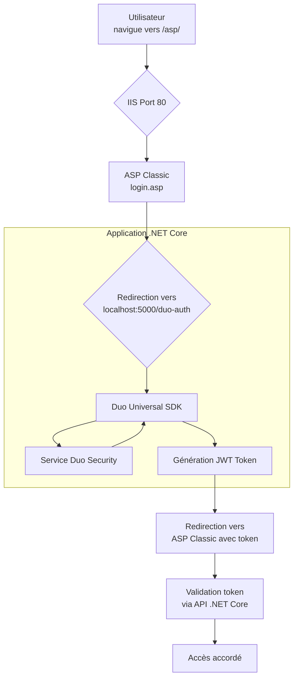

# 🔍 Projet ASP Classic avec Authentification Duo

## 📁 Structure du Projet

```
C:\inetpub\wwwroot\asp\
├── 📄 login.asp              # Page de connexion principale
├── 📄 duo_callback.asp       # Gestion du callback Duo
├── 📄 protected.asp          # Page protégée après authentification
├── 📄 logout.asp             # Déconnexion
├── 📄 index.html             # Page d'accueil
├── 📄 web.config             # Configuration IIS
├── 📄 duo_config.txt         # Configuration Duo
│
├── 📁 includes/               # Fonctions et utilitaires
│   ├── 📄 auth.asp           # Fonctions d'authentification de base
│   └── 📄 duo_auth.asp       # Fonctions d'authentification Duo
│
├── 📁 DuoAuthCore/           # Application .NET Core (port 5000)
│   └── 📄 appsettings.json   # Configuration .NET Core
│
├── 📁 data/                   # Données utilisateurs
│   └── 📄 users.txt          # Liste des utilisateurs
│
└── 📁 .vscode/               # Configuration VS Code
```

## 🌐 Architecture de Fonctionnement

Votre application utilise une **architecture hybride** :

- **ASP Classic** (Port 80) : Interface utilisateur et logique métier
- **ASP.NET Core** (Port 5000) : Gestion de l'authentification Duo



## 🚀 Démarrage Rapide

### 1. **Démarrer l'application .NET Core :**
```bash
cd DuoAuthCore
dotnet run --urls="http://localhost:5000;https://localhost:5001"
```

### 2. **Accéder à l'application :**
- **URL principale** : `http://localhost/asp/`
- **Port .NET Core** : `http://localhost:5000`

## 📋 Configuration

### **Fichiers de configuration :**
- `duo_config.txt` : Paramètres Duo pour ASP Classic
- `DuoAuthCore/appsettings.json` : Configuration .NET Core

### **Variables d'environnement :**
- `DUO_CLIENT_ID` : Votre ID client Duo
- `DUO_CLIENT_SECRET` : Votre secret client Duo
- `DUO_API_HOST` : Votre hôte API Duo

## 🔒 Sécurité

- **Authentification à deux facteurs** via Duo Security
- **Protection CSRF** avec génération de state
- **Sessions sécurisées** avec validation des tokens

## 📚 Documentation

- **README.md** : Ce fichier (vue d'ensemble)
- **README_DUO.md** : Documentation détaillée de l'intégration Duo

## 🛠️ Développement

### **Structure recommandée :**
- Gardez les fichiers ASP Classic dans la racine
- Utilisez le dossier `includes/` pour les fonctions réutilisables
- Testez sur `localhost:5000` avant de déployer

### **Débogage :**
- Vérifiez les logs IIS dans l'Observateur d'événements
- Utilisez `Response.Write` pour le débogage ASP Classic
- Surveillez la console .NET Core pour les erreurs